# Orion: Enabling Self-adaptive Memory Management for On-device Online Continual Learning

Zexin Li $^{*1}$ , Nikil Dutt $^{\dagger 2}$ , and Cong Liu $^{\ddagger 1}$

$^{1}$ University of California, Riverside

$^{2}$ University of California, Irvine

# Abstract

Online continual learning (OCL) enables real-time adaptation to new data, making it crucial for dynamic robotic applications. However, its practical deployment is hindered by memory constraints in resource-limited systems, which affect key trade-offs in training latency, plasticity, and stability. Unlike offline parameter tuning, which cannot account for the dynamic shift in memory pressure and workload complexity as OCL progresses, an online and self-adaptive approach is essential for robust on-device deployment. This paper proposes Orion, a holistic framework designed to co-optimize training latency, plasticity, and stability of state-of-the-art OCL models under strict memory constraints, enabling feasible on-device deployment. At its core, Orion leverages URGE, a unified runtime indicator grounded in the "Buckets effect" principle that system performance is bounded by its scarcest resource, to dynamically reallocate memory across OCL components by jointly coordinating batch processing, replay buffers, and optimization strategies at both the OS and application level. Furthermore, Orion introduces system-level data prefetching techniques to maximize efficiency. A system prototype of Orion has been implemented using the widely adopted Avalanche-lib and thoroughly evaluated across a diverse range of OCL algorithms, benchmarks, and hardware platforms commonly used in autonomous robotic applications. To further demonstrate its practical utility, Orion is integrated into a realistic autonomous navigational robot powered by OCL. The results show that Orion achieves significant training speedups while maintaining balanced performance and effectively adapting to various scenarios, all with minimal runtime, memory, and energy overhead, making Orion a practical solution for on-device continual learning.

# 1 Introduction

Online continual learning (OCL) addresses the challenge of learning from non-stationary, streaming data while mitigating catastrophic forgetting $[1-8]$ . This capability is critical for robotics and other embodied AI systems that must adapt in real time in dynamic environments such as transportation, agriculture, and defense $[9-13]$ . Unlike offline retraining on fixed datasets, OCL updates the model incrementally in a single pass over new experiences, making both algorithmic behavior and systems design central to practical deployment $[14, 15]$ .

OCL performance is commonly characterized by plasticity (fast adaptation to new experiences) and stability (retention of prior knowledge), together with training latency, i.e., how quickly the model incorporates new data $[16]$ . On-device deployment adds a fourth, implicit axis: memory. Recently, replay-based methods such as ER $[1]$ revisit stored experiences and are effective across diverse settings, including

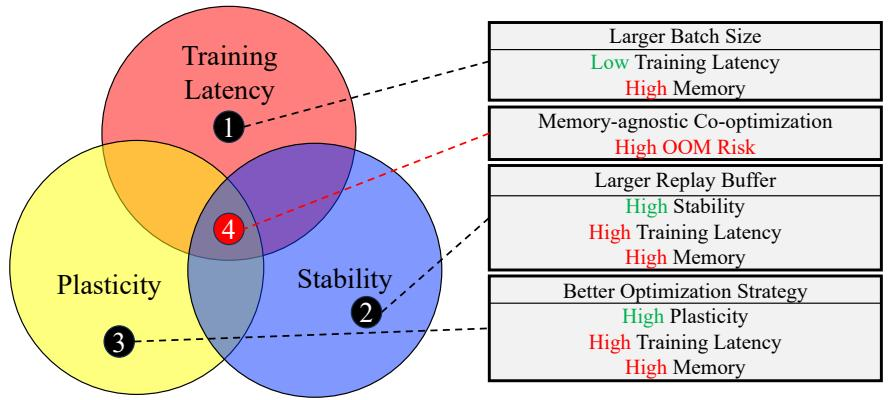

flowchart

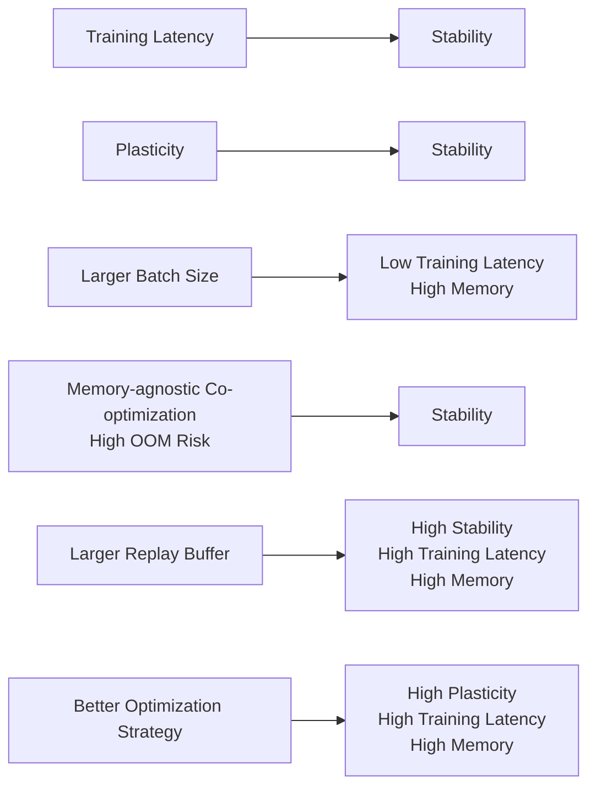

Figure 1: No silver bullet. Visualization of the complex tradeoff space among three key performance metrics of on-device OCL. Memory-agnostic co-optimizing training latency, plasticity, and stability could easily raise out-of-memory (OOM) concerns under stringent memory constraints.

resource-constrained platforms [2]. Memory selection (GSS) favors informative samples [5]. Constraint-and regularization-based methods, e.g., GEM [3], AGEM [4], EWC [6], and LwF [7], preserve past knowledge via gradient projections or parameter consolidation. Beyond algorithms, system-level efforts remain limited: LifeLearner targets hardware-level optimization for meta-continual learning [17], Ekya optimizes offline CL pipelines on multi-GPU servers [18], and Latent Replay focuses on algorithmic changes without systems co-design [19]. Yet none of these efforts jointly address runtime memory constraints, algorithmic efficacy, and system-level co-design for on-device OCL. This gap is critical, as autonomous robots and edge devices increasingly require real-time adaptation under strict hardware budgets in the field, far from data centers and without opportunity for offline retraining.

More challenging, the trade-off space of on-device OCL is inherently conflicted: batch scaling reduces latency but inflates memory, larger buffers help stability, but risk OOM, and stronger optimization improves plasticity while increasing compute and memory traffic. Figure 1 summarizes this “no silver bullet” landscape and motivates an adaptive, memory-aware runtime. Critically, because memory pressure and workload complexity shift dynamically as the number of OCL experiences grows, any static offline configuration could be either too conservative and waste resources early, or too aggressive and cause OOM failures later. This necessitates an online, self-adaptive memory manager.

Contributions. This work introduces Orion, a self-adaptive memory management ecosystem for on-device OCL that addresses the challenge of balancing training latency, plasticity, and stability under stringent memory constraints. Managing these trade-offs is non-trivial due to OS-level allocation and runtime variability; doing so robustly requires tight integration of application- and system-level decisions, especially on embedded platforms.

At its core, Orion introduces URGE, a unified runtime indicator that dynamically optimizes the OCL process without manual intervention. While URGE's formulation is intentionally pragmatic and interpretable, inspired by Liebig's Law of the Minimum [20], we demonstrate it is robust across diverse benchmarks, hardware platforms, and OCL algorithms. By integrating performance metrics (plasticity, stability, latency), balancing memory usage with system constraints to prevent OOM errors, and adapting to workload changes using time-dependent thresholds, URGE enables autonomous memory reallocation across OCL components. This self-adaptive mechanism ensures efficient resource utilization, enabling Orion to maintain OCL algorithmic performance while adhering to strict resource constraints. In addition, we prototype a practical system for real-world deployment by extending the Avalanche-lib library [21, 22] with system-level optimizations tailored for embedded and edge platforms. A key module is our unified, multi-threaded data prefetcher that leverages idle CPU resources to proactively load streaming and replay data, reducing training bottlenecks. All enhancements are implemented as transparent modules, enabling rapid deployment of

Orion across diverse hardware, including ARM64-based embedded devices and edge servers.

Implementation and Evaluation. Orion is evaluated on standard OCL benchmarks $[23–26]$ and four representative algorithms $[1, 3–5]$ , across platforms ranging from high-performance edge servers to memory-constrained embedded devices $[27, 28]$ . We further demonstrate practicality in an autonomous driving case study built on EndlessCL-Sim $[26]$ with a navigational TurtleBot 3.

Key highlights of Orion include:

- Overall Effectiveness and Versatility: Orion was evaluated on one edge server and two GPU-enabled autonomous embedded systems, demonstrating its ability to balance training latency, plasticity, and stability in OCL training. It adapts to different platforms, benchmarks, OCL algorithms, and user preferences while consistently meeting memory constraints. Orion achieved an average 12.13× speedups w.r.t. training latency compared to online baselines, with minimal trade-offs in other performance metrics, specifically, an average plasticity and stability reduction of less than 10% compared to the offline brute-force Oracle baseline (Sec. 5.2).  
- Practical Usability: A robotic case study validated the practicality and efficacy of Orion in real-world OCL scenarios. It successfully auto-balances training latency, plasticity, and stability, without encountering any OOM errors during deployment (Sec. 5.3).  
- Low Overhead: Orion exhibits low execution overhead ranging from 0.47% to 2.10%, almost negligible memory overhead between 0.016% to 0.042%, and negligible energy overhead of less than 0.1% across a rich set of OCL scenarios (Sec. 5.5).

# 2 Background

# 2.1 Online Continual Learning

Online Continual Learning (OCL) enables systems to incrementally learn from streaming data, adapting to new information while retaining prior knowledge $[14]$ . Unlike traditional deep learning, which relies on static datasets and offline retraining, OCL is essential for dynamic, real-world applications where data evolves, and full dataset retraining is impractical. OCL processes sequential experiences, new batches of data, by incrementally updating model parameters and balancing adaptation to new data with retention of prior learned knowledge. In real-world robotic applications, OCL provides a lightweight mechanism for adapting to new lighting or terrains in autonomous navigation, recognizing novel objects on the fly $[19]$ , updating person re-identification models under varying conditions $[29]$ , and continuously refining physical manipulation skills $[30]$ .

OCL introduces unique challenges due to its online workload characteristics. It cannot rely on multiple runs or offline optimization methods, thus inherently requiring fast, adaptive system-application coordination. Unlike offline methods, OCL demands rapid, incremental learning, which makes it particularly challenging for resource-constrained devices where low training latency is critical $[15]$ .

Following state-of-the-art OCL algorithms [2, 16], we evaluate on-device OCL performance using the following metrics

- Plasticity: the ability to adapt to new data.  
- Stability: the ability to retain accuracy on previously learned data.  
- Training Latency: The speed of adaptation to new data, where higher latency may indicate slower adaption and reduced accuracy [16].

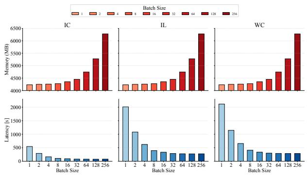

bar

| Configuration | Batch Size | Memory (MB) | Latency (s) |
| :--- | :--- | :--- | :--- |
| IC | 1 | ~4250 | ~550 |
| IC | 2 | ~4275 | ~300 |
| IC | 4 | ~4275 | ~180 |
| IC | 8 | ~4300 | ~120 |
| IC | 16 | ~4375 | ~110 |
| IC | 32 | ~4450 | ~90 |
| IC | 64 | ~4750 | ~90 |
| IC | 128 | ~5300 | ~80 |
| IC | 256 | ~6300 | ~80 |
| IL | 1 | ~4250 | ~2000 |
| IL | 2 | ~4275 | ~1100 |
| IL | 4 | ~4275 | ~620 |
| IL | 8 | ~4300 | ~400 |
| IL | 16 | ~4375 | ~350 |
| IL | 32 | ~4450 | ~300 |
| IL | 64 | ~4750 | ~280 |
| IL | 128 | ~5300 | ~280 |
| IL | 256 | ~6300 | ~280 |
| WC | 1 | ~4250 | ~2150 |
| WC | 2 | ~4275 | ~1180 |
| WC | 4 | ~4275 | ~660 |
| WC | 8 | ~4300 | ~420 |
| WC | 16 | ~4375 | ~350 |
| WC | 32 | ~4450 | ~330 |
| WC | 64 | ~4750 | ~300 |
| WC | 128 | ~5300 | ~300 |
| WC | 256 | ~6300 | ~300 |

(a) Effect of training batch size on OCL metrics.

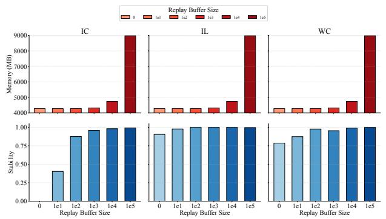

bar

| Method | Replay Buffer Size | Memory (MB)::0 | Memory (MB)::1e1 | Memory (MB)::1e2 | Memory (MB)::1e3 | Memory (MB)::1e4 | Memory (MB)::1e5 |
| --- | --- | --- | --- | --- | --- | --- | --- |
| IC | 0 | ~4250 | ~4250 | ~4250 | ~4250 | ~4300 | ~4750 |
| IC | 1e1 | — | — | — | — | — | — |
| IC | 1e2 | — | — | — | — | — | — |
| IC | 1e3 | — | — | — | — | — | — |
| IC | 1e4 | — | — | — | — | — | — |
| IC | 1e5 | — | — | — | — | — | ~9000 |
| IL | 0 | ~4250 | ~4250 | ~4250 | ~4250 | ~4300 | ~4750 |
| IL | 1e1 | — | — | — | — | — | — |
| IL | 1e2 | — | — | — | — | — | — |
| IL | 1e3 | — | — | — | — | — | — |
| IL | 1e4 | — | — | — | — | — | ~4750 |
| WC | 0 | ~4250 | ~4250 | ~4250 | ~4250 | ~4300 | ~4750 |
| WC | 1e1 | — | — | — | — | — | — |
| WC | 1e2 | — | — | — | — | — | — |
| WC | 1e3 | — | — | — | — | — | ~4750 |
| WC | 1e4 | — | — | — | — | — | ~9000 |
| WC | 1e5 | — | — | — | — | — | ~9000 |

(b) Effect of replay buffer size on OCL metrics.  
Figure 2: Impact of key hyperparameter choices on OCL metrics under memory constraints.

\- Memory: adherence to stringent memory constraints, which is crucial for on-device deployment.

Formally, given a dataset D and experience number N, we define plasticity (P), and stability (S) for the K-th experience $(\mathcal{K} \leq \mathcal{N})$ as follows: Plasticity (P) indicates the ability to adapt to new knowledge: $P = \frac{1}{\mathcal{K}} \sum_{i=1}^{\mathcal{K}} acc_i$ , where $acc_i$ is the test accuracy on the i-th experience. Stability (S) indicates the ability to maintain previously learned knowledge while integrating new knowledge:

$$
S = \left\{ \begin{array}{l l} 1 & \text {if} \mathcal {K} = 1, \\ 1 - \frac {1}{\mathcal {K} - 1} \sum_ {i = 1} ^ {\mathcal {K} - 1} \mathcal {F} _ {i} & \text {if} \mathcal {K} > 1. \end{array} \right.
$$

where $F_{i}$ measures how much knowledge about previous experiences is lost after learning the i-th experience. This equation also considers that when K = 1, there are no prior experiences to evaluate forgetting, so stability is set to one. Plasticity and stability can be assessed immediately after training in each experience, without needing to complete the entire OCL process.

To gain a comprehensive understanding of the performance of on-device OCL, it is essential to focus on two key OCL components: batch execution and replay buffer. Batch execution involves processing multiple data samples in a single operation, fostering effective learning. On the other hand, the replay buffer serves as a repository for past experiences, which are sampled for conducting mini-batch training. These components significantly impact algorithmic performance, that is, plasticity and stability, and system-level memory usage and training latency. Specifically, we explore the impacts of key OCL parameters on the above metrics, including (1) training batch size, which defines the amount of data used in each mini-batch training; (2) replay buffer size, which determines the amount of data stored for revisitation; and (3) optimization strategies tailored for enhancing plasticity.

# 3 Motivation

This section thoroughly examines the critical trade-offs in on-device OCL under stringent memory constraints, highlighting specific challenges through a series of realistic case studies. Understanding and quantifying these trade-offs provides valuable insights into how to effectively co-optimize plasticity, stability, and resource usage, guiding the development of more robust and efficient deployable solutions.

On-device OCL must jointly balance training latency, plasticity, and stability under tight memory budgets. We study three levers that practitioners frequently adjust in practice (batch size, replay buffer size, and optimization plugins), and find that memory is the shared bottleneck that frequently drives failures on embedded platforms.

Table 1: Integrating OCL plugins into ER. Best results are marked. Subscripts show differences from the baseline.

<table><tr><td>Metrics</td><td colspan="4">Training Latency (s)</td><td colspan="4">Plasticity</td><td colspan="4">Memory (MB)</td></tr><tr><td>Setting</td><td>w/o Opt.</td><td>GEM</td><td>EWC</td><td>GEM+EWC</td><td>w/o Opt.</td><td>GEM</td><td>EWC</td><td>GEM+EWC</td><td>w/o Opt.</td><td>GEM</td><td>EWC</td><td>GEM+EWC</td></tr><tr><td>IC</td><td>73.06</td><td>147.40+74.34</td><td>147.18+74.12</td><td>215.13+142.07</td><td>0.98</td><td>0.99+0.01</td><td>0.99+0.01</td><td>0.99+0.01</td><td>4100</td><td>4195+95</td><td>4200+100</td><td>4207+107</td></tr><tr><td>IL</td><td>263.28</td><td>505.00+241.72</td><td>537.28+274.00</td><td>771.61+508.33</td><td>0.94</td><td>0.94+0.00</td><td>0.98+0.04</td><td>0.93-0.01</td><td>4250</td><td>4347+97</td><td>4352+102</td><td>4360+110</td></tr><tr><td>WC</td><td>268.88</td><td>527.16+258.28</td><td>560.63+291.75</td><td>817.82+548.94</td><td>0.97</td><td>0.89-0.08</td><td>0.93-0.04</td><td>0.97+0.00</td><td>4180</td><td>4270+90</td><td>4281+101</td><td>4301+121</td></tr></table>

We first vary the training batch size and measure its effect across the Incremental Class (IC), Incremental Learning (IL), and Weather Classification (WC) scenarios. As illustrated in Figure 2a, batch size dictates a severe trade-off between training latency and memory consumption. While small batch sizes (e.g., 1 to 16) keep memory usage manageable at roughly 4.2 GB, they incur prohibitive training latencies, exceeding 2000 seconds in the IL and WC scenarios, which effectively prevents real-time robotic adaptation. Conversely, scaling the batch size to 256 drastically reduces latency to under 200 seconds, but inflates memory consumption well beyond 6 GB. On edge devices equipped with 4 to 8 GB of unified memory, such aggressive batching guarantees Out-Of-Memory (OOM) failures.

Next, we analyze the impact of replay buffer size. Figure 2b demonstrates a clear pattern of diminishing returns. Stability improves dramatically as the buffer size expands from 0 to $10^{3}$ , successfully mitigating catastrophic forgetting. However, beyond $10^{4}$ , stability saturates at nearly 1.0. Meanwhile, memory usage remains relatively stable (4.2 to 4.7 GB) up to $10^{4}$ but experiences a massive, abrupt spike to approximately 9 GB at $10^{5}$ . Allocating excessively large buffers yields negligible performance benefits while ensuring memory exhaustion on resource-constrained platforms, underscoring the need for precise, context-aware sizing rather than naive maximization.

Finally, we examine the deployment overhead of integrating state-of-the-art algorithmic plugins (GEM and EWC) into the baseline Experience Replay (ER) algorithm. As detailed in Table 1, these plugins successfully enhance model plasticity (e.g., from 0.94 to 0.98 in IL) and help preserve stability. However, this algorithmic superiority is not free on the edge. The computational complexity of calculating gradient projections (GEM) or Fisher information matrices (EWC) doubles or even triples the training latency (e.g., IC latency jumps from 73 s to over 215 s with GEM+EWC). Furthermore, maintaining these auxiliary structures consistently inflates memory usage by roughly 90 to 121 MB across scenarios. This demonstrates that purely algorithmic OCL advancements can severely penalize system-level responsiveness if deployed indiscriminately.

In summary, these empirical case studies reveal that OCL optimization goals are inherently coupled and frequently conflicting. Maximizing learning performance (plasticity and stability) via larger batches, expanded buffers, or advanced plugins fundamentally degrades system performance (latency and memory footprint). Because edge devices operate under strict, non-negotiable hardware ceilings, there is no static, universally optimal configuration. Instead, realizing deployable on-device OCL demands an intelligent, dynamic co-optimization strategy that treats hardware constraints and algorithmic efficacy as a joint, multi-objective problem.

Takeaway: Taken together, these three patterns all draw from the same memory pool. When batch size increases, when the buffer grows, or when heavier plugins are enabled, the combined footprint often exceeds device capacity, which leads to OOM and unstable training. Managing these trade-offs is a systems problem. Operating system memory allocation interacts with algorithm choices; static or memory blind tuning is brittle. We need a fast and self-adaptive memory manager that coordinates batch processing, replay buffers, and plugin usage to avoid OOM while preserving stability and training efficiency. The next section develops this design.

# 4 System Design

# 4.1 Design Overview

Our proposed system, named Orion, is a holistic framework designed to optimize OCL systems through self-adaptive runtime memory management, balancing system performance and resource constraints. Importantly, Orion is transparent to the online continual learning process and can be seamlessly integrated into existing OCL frameworks. This ensures that training and evaluation steps remain consistent with established practices in the field, aligning with the methodologies used in state-of-the-art continual learning studies $[4, 5]$ . Specifically, Orion maintains transparency between data and experience splits in benchmark evaluations, adhering to the protocols followed in prior continual learning works.

As shown in Fig. 3, Orion employs a hierarchical control framework guided by a unified, system-aware indicator (URGE). This indicator integrates multiple performance metrics to provide a comprehensive evaluation of the system's state and serves as the foundation for decision-making. Intuitively, URGE captures the trade-offs between system performance and memory resource availability. A high URGE value indicates that resources are abundant but the system is underperforming, suggesting both the opportunity and urgency for optimization without significant risk of overloading memory. Conversely, a low URGE value reflects either: (1) the system is performing sufficiently well and does not require further optimization, or (2) resource constraints that make further optimization impractical or risky due to potential OOM errors. (Detailed calculation and application of URGE is in Sec. 4.2.)

Orion implements a hierarchical control framework which operates at two levels: (1) Coarse-grained control (Algorithm 1, lines 3-5): At this level, URGE is calculated to guide high-level decisions about the overall optimizing direction of the OCL system. (2) Fine-grained control (Algorithm 1, lines 6-20): This level involves a more granular approach to optimizing system performance. After each experience of the OCL process, URGE is calculated and incorporated with a time-dependent threshold to make adaptive memory management decisions, as detailed in Section 4.3.

Beyond its adaptive control logic, Orion features practical engineering enhancements to address OCL deployment bottlenecks. Notably, we prototype a unified, multi-threaded data prefetching module that leverages idle CPU resources to mitigate data loading latency and improve end-to-end training performance. All system-level optimizations are implemented as transparent, drop-in modules within our prototype, ensuring compatibility with the standard Avalanche pipeline and minimal engineering overhead for end users. Details of these engineering contributions are described in Section 4.5.

# 4.2 The Design of URGE

The design of URGE is inspired by the Liebig's Law of the Minimum (also known as the “Buckets effect”) [20], which posits that growth is limited not by the total resources available but by the scarcest resource (limiting factor). In this context, URGE ensures that the system achieves a balance among key metrics: plasticity, stability, and latency while minimizing memory usage. The “Buckets effect” analogy highlights the intuition behind the design of URGE. Specifically, when plasticity is high, stability is high, latency is too low (indicating overly fast training), or when memory usage risks an OOM (out-of-memory) error, the URGE decreases, leading to more conservative memory allocation (Algorithm 1 line 11-13). Conversely, under more favorable conditions, such as lower memory usage risk, the URGE increases, allowing for more aggressive memory allocation (Algorithm 1 line 7-9). We will elaborate on the precise design of URGE later.

Formally, let $P_{t}$ and $S_{t}$ represent the plasticity and stability at time t, respectively. Let $P_{th}$ and $S_{th}$ be the corresponding thresholds. Let $L_{t}$ represent the training latency at time t, and $L_{th}$ be the latency threshold. $M_{t}$ is the memory usage at time t, $M_{max}$ is the maximum allowed memory. We define the URGE at time t

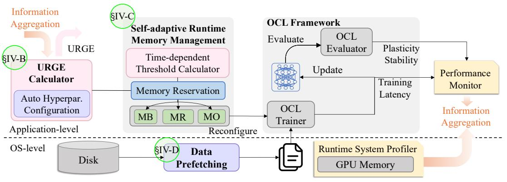

flowchart

This flowchart illustrates the architecture of an OCL (Over-Cloud Layer) framework, showing data flow from OS levels through self-adaptive memory management and OCL framework evaluation to performance monitoring.

Figure 3: Design overview of Orion.

as

$$
\mathrm{URGE} _ {t} = \frac {1}{1 + e ^ {k _ {p} \left(P _ {t} - P _ {t h}\right)}} \cdot \frac {1}{1 + e ^ {k _ {s} \left(S _ {t} - S _ {t h}\right)}} \tag {1}
$$

$$
\cdot \frac {1}{1 + e ^ {- k _ {l} (L _ {t} - L _ {t h})}} \cdot \frac {1}{1 + e ^ {k _ {m} (M _ {t} - M _ {m a x})}}
$$

where $k_p$ , $k_s$ , $k_l$ , and $k_m$ are scaling factors that control the sensitivity of the URGE to changes in plasticity, stability, training latency, and memory pressure, respectively. The terms in the URGE equation (Eq. 1) reflect the system's state. If plasticity is low, the first term is high; If stability is low, the second term is high; If training latency is high, the third term is high. These scenarios highlight how different factors may influence URGE, and consequently, the configuration of the OCL system. Intuitively, when any of these terms is high, i URGE increases, signaling the need to optimize plasticity, stability, or training latency, if sufficient memory is available. The system responds by increasing the batch size, enlarging the replay buffer, or enabling advanced optimization strategies to address these deficiencies (Algorithm 1, line 7-9).

Memory usage is critical in preventing OOM errors. When memory usage is high, the fourth term in Eq. 1 decreases, penalizing the URGE. In response, the system decreases the batch size and replay buffer size and disables advanced optimization strategies to free up memory resources, minimizing the risk of OOM errors (Algorithm 1, line 11-13).

# 4.3 Self-adaptive Memory Management

This section explains how Orion leverages URGE for self-adaptive memory management. By dynamically adjusting memory allocation in response to performance metrics, resource constraints, and workload complexity, Orion ensures efficient and robust optimization for on-device OCL systems.

Time-dependent Threshold. While performance metrics such as stability and plasticity are only accessible after the completion of training for one experience rather than during training, they remain instrumental for guiding fine-grained control. This is particularly relevant in OCL, where workloads dynamically evolve. As the OCL progresses, each experience typically exhibits increasing training latency due to the growing computational complexity required to retain old knowledge. This dynamic is distinct from the relatively homogeneous patterns in training latency observed during each training epoch of the standard Deep Neural Network fine-tuning process $[31]$ . To account for this, we introduce a time-dependent threshold, $Thr_{t}$ , that decreases over time to encourage a more aggressive optimization policy as training advances:

$$
\mathrm{Thr} _ {t} = \mathrm{Thr} _ {0} \cdot e ^ {- \delta t} \tag {2}
$$

where $Thr_{0}$ is the initial threshold value, and $\delta$ is a constant decay rate hyperparameter that controls how quickly the threshold decreases over time.

Unified URGE-based Memory Management. We propose a unified memory manager for application-aware memory allocation and reallocation dynamically. The memory manager uses URGE and system memory availability to make decisions about memory reservations for each OCL component and reactively adjust application-level control knobs (batch size, replay buffer size, and optimization strategies).

The memory allocated for batch processing can be dynamically adjusted based on URGE:

$$
M B _ {t} = \left\{ \begin{array}{l l} M B _ {0}, & \text {if} t = 0 \\ M B _ {t - 1} \cdot \left(1 + \alpha \cdot \left(\mathrm{URGE} _ {t} - \operatorname{Thr} _ {t}\right)\right), & \text {if} t > 0 \end{array} \right. \tag {3}
$$

where $MB_{t-1}$ is the batch processing memory at the previous time step, and $\alpha$ is a scaling factor that controls the sensitivity of the batch processing memory to changes in the URGE. If URGE exceeds the time-dependent threshold, the batch processing memory will be increased by a factor of $(1+\alpha\cdot(\mathrm{URGE}_{t}-\mathrm{Thr}_{t}))$ to accelerate the learning process. For example, if $\alpha=0.1$ , $URGE_{t}=0.8$ , and $Thr_{t}=0.7$ , then the batch processing memory will increase by a factor of $1+0.1\cdot(0.8-0.7)=1.01$ . After that, batch size at time t could be calculated by $B_{t}=\lfloor\frac{MB_{t}}{M_{batch}}\rfloor$ , where $M_{batch}$ is memory consumption for each batch data. $M_{batch}$ could be easily accessed offline, based on the characteristics of continual learning environments and tasks. This value is invariant to hardware devices.

The replay buffer memory is managed based on the URGE in a similar manner:

$$
M R _ {t} = \left\{ \begin{array}{l l} M R _ {0}, & \text {if} t = 0 \\ M R _ {t - 1} \cdot \left(1 + \beta \cdot \left(\mathrm{URGE} _ {t} - \operatorname{Thr} _ {t}\right)\right), & \text {if} t > 0 \end{array} \right. \tag {4}
$$

where $MR_{t-1}$ is the replay buffer memory at the previous time step, and $\beta$ is a scaling factor that controls the sensitivity of the replay buffer memory to changes in the URGE. If URGE is higher than the threshold, the replay buffer memory will increase by multiplying a factor of $(1 + \beta \cdot (\mathrm{URGE}_{t} - \mathrm{Thr}_{t}))$ to allow for more diverse samples during training and improve stability. For example, if $\beta = 0.2$ , $URGE_{t} = 0.8$ , and $Thr_{t} = 0.7$ , then the replay buffer memory will increase by multiplying by a factor of $1 + 0.2 \cdot (0.8 - 0.7) = 1.02$ . After that, the replay buffer size at time t could be calculated by $R_{t} = \lfloor \frac{MR_{t}}{M_{df}} \rfloor$ , where $M_{df}$ is memory consumption for each data frame. Note that this calculation is conservative in avoiding OOM because although the replay buffer may not be immediately filled up, actual memory consumption could be lower than the calculation. $M_{df}$ could be easily accessed offline and is invariant to hardware devices.

Memory allocation for optimization strategies is managed as follows:

$$
M O _ {t} = \left\{ \begin{array}{l l} M O _ {\text {advanced}}, & \text {if URGE} _ {t} \geq \operatorname{Thr} _ {t} \\ M O _ {\text {default}}, & \text {if URGE} _ {t} <   \operatorname{Thr} _ {t} \end{array} \right. \tag {5}
$$

where $MO_{advanced}$ represents the memory consumption of more advanced optimization strategies that can improve the model's ability to learn new knowledge, and $MO_{default}$ represents the memory consumption of less memory-intensive optimization strategies.

Note that memory management for optimization is particularly challenging because it is correlated to batch size and replay buffer size in the above and could be hard to estimate precisely. Therefore, we roughly assume that all the unprofiled memory measured at the system level in OCL, except for batch processing memory and replay buffer memory, is consumed by optimization. Specifically, we estimate the relationship between $MO_{advanced}$ and $MO_{default}$ as $MO_{advanced} = kMO_{default}$ , where k is a factor that can be determined rapidly at runtime.

# 4.4 Automatic Hyperparameter Configuration

To automatically set the hyperparameters $k_{p}$ , $k_{s}$ , $k_{l}$ , and $k_{m}$ based on a user-specified order of importance, we propose a rule-based method. Users provide the importance order as a list of metrics, e.g., [memory,

Algorithm 1 URGE-based Self-adaptive Memory Management for OCL

Input: OCL dataset $D$; initial memory allocations $MB_0, MR_0, MO_0$; initial threshold $\text{Thr}_0$; scaling factors $\alpha, \beta$; decay rate $\delta$
Initialize: $MB_t \leftarrow MB_0, MR_t \leftarrow MR_0, MO_t \leftarrow MO_0, \text{URGE}_0 \leftarrow 1, t \leftarrow 0$
for each experience $e$ in $D$ do
    Execute training with current $MB_t, MR_t$, and $MO_t$
    Compute $\text{URGE}_t$ using Eq. (1)
    Compute $\text{Thr}_t$ using Eq. (2)
    if $\text{URGE}_t &gt; \text{Thr}_t$ then
        $MB_t \leftarrow MB_{t-1} \cdot (1 + \alpha \cdot (\text{URGE}_t - \text{Thr}_t))$ $MR_t \leftarrow MR_{t-1} \cdot (1 + \beta \cdot (\text{URGE}_t - \text{Thr}_t))$ $MO_t \leftarrow MO_{advanced}$
    else
        $MB_t \leftarrow MB_{t-1} \cdot (1 - \alpha \cdot (\text{Thr}_t - \text{URGE}_t))$ $MR_t \leftarrow MR_{t-1} \cdot (1 - \beta \cdot (\text{Thr}_t - \text{URGE}_t))$ $MO_t \leftarrow MO_{default}$
    end if
    Reconfigure the training system based on updated memory allocations
    Launch training for experience $e$
    Prefetch data for the next experience
    $t \leftarrow t + 1$
end for

plasticity, stability, training latency]. Orion then assigns weights to each metric based on its position in the list, with the last factor receiving a weight of 1, the second-to-last a weight of 2, and so forth. For instance, if the user specifies the importance order as [memory, plasticity, stability, training latency], the weights for each metric are $(w_{m}, w_{p}, w_{s}, w_{l}) = (4, 3, 2, 1)$ . We then normalize the weights by $k_{*} = \frac{w_{*}}{\sum_{w}}$ to ensure that $k_{m} + k_{p} + k_{s} + k_{l} = 1$ . After normalization, $(k_{m}, k_{p}, k_{s}, k_{l})$ is set to be $(0.4, 0.3, 0.2, 0.1)$ . This rule-based method ensures that the URGE is more calculated considering user-specified preferences. Note that the time complexity of calculating URGE at runtime is O(e) where e is the experience number for OCL, as it is only computed at the boundary between training experiences. This ensures that we can quickly assess URGE during the OCL process.

# 4.5 System Prototype Implementation

Our OCL toolchain is developed as an extension of the Avalanche [21] continual learning library, with targeted adaptations for ARM64-based embedded platforms. All system-level optimizations are designed as transparent modules, ensuring full compatibility with the standard Avalanche pipeline and imposing minimal engineering overhead for end users. These enhancements are evaluated in Sec. 5, where we demonstrate their impact on training latency under real-world OCL workloads. To address data loading bottlenecks common in continual learning scenarios, we introduce a unified, multi-threaded data prefetching module. Operating in parallel with the main training loop, the CPU proactively loads and stages both streaming and replay samples ahead of time, while the GPU remains dedicated to model training. Our implementation unifies the disparate data access patterns of raw and replay buffers in OCL, leveraging Python threading to ensure data is always available at iteration boundaries and avoiding blocking overhead. As described in Algorithm 1, this co-optimized pipeline reduces end-to-end training latency and maximizes system resource utilization. All modifications require no changes to Avalanche's core logic and supporting rapid deployment across diverse hardware platforms.

Table 2: Statistics of benchmark datasets used in this work. IC: Incremental Class, IL: Incremental Illumination, WC: Weather Change, NI: New Instances, NC: New Classes, NIC: New Instances and Classes.

<table><tr><td>Dataset</td><td>Size</td><td>Task</td><td># Experience</td><td># Images</td><td>Image Size</td></tr><tr><td>SplitCIFAR10 [23]</td><td>Small</td><td>IC</td><td>10</td><td>60,000</td><td>32×32</td></tr><tr><td>SplitCIFAR100 [23]</td><td>Small</td><td>IC</td><td>10</td><td>60,000</td><td>32×32</td></tr><tr><td rowspan="3">CORe50 [24, 25]</td><td>Medium</td><td>NI</td><td>8</td><td>164,866</td><td>32×32</td></tr><tr><td>Medium</td><td>NC</td><td>9</td><td>164,866</td><td>32×32</td></tr><tr><td>Large</td><td>NIC</td><td>79</td><td>164,866</td><td>32×32</td></tr><tr><td rowspan="3">Endless-Sim [26]</td><td>N/A</td><td>IC</td><td>4</td><td>49,134</td><td>32×32</td></tr><tr><td>N/A</td><td>IL</td><td>5</td><td>181,899</td><td>32×32</td></tr><tr><td>N/A</td><td>WC</td><td>5</td><td>188,536</td><td>32×32</td></tr></table>

# 5 Evaluation

# 5.1 Experimental Setup

Testbeds. Our testbeds include three platforms exhibiting different memory constraints: an edge server with A4500 GPU and two GPU-enabled embedded devices, Xavier, and Orin, which are widely used in autonomous driving $[32, 33]$ and robotics $[34–37]$ .

OCL algorithms and benchmarking dataset. To ensure a comprehensive evaluation of Orion, we assess the performance metrics on four prominent OCL algorithms, including ER [1], GSS [5], GEM [3], and AGEM [4], based on ResNet-20 [38] DNN architecture. These algorithms represent various OCL approaches, ensuring a comprehensive assessment of Orion across various settings. We evaluate Orion on a set of widely studied OCL benchmarks involving different sizes and different OCL tasks as detailed in Tab. 2.

Robotic case study. To further demonstrate the practicality of Orion in realistic scenarios, we conduct a robotic case study in the context of autonomous driving using Endless-Sim [26], under incremental class learning (IC), incremental illumination conditions (IL), and weather changes (WC).

Baselines. We compare Orion to the following approaches:

- LR [19]: A state-of-the-art baseline leveraging latent replay for real-time continual learning in robotics. It reduces computations by replaying latent DNN results instead of raw data, using default Avalanche-lib parameters.  
- MAX-A [21]: MAX-A uses preset values for training parameters in Avalanche-lib for empirical good plasticity and stability in general OCL scenarios.  
- MAX-P [21]: a high-efficiency implementation version of Avalanche-lib, targeting optimized training latency and maximizing throughput with a large batch size.  
- Oracle: We conduct an offline parameter search by brute force to ensure optimized plasticity and stability.

Implementation details. We implement MAX-A [21] by using default configurations for batch processing and replay buffer in Avalanche-lib, enabling both optimization plugins to boost performance. MAX-P [21] is implemented by modifying Avalanche-lib using a large batch size and a small replay buffer size. We also fully implement LR [19] and integrate it with Avalanche-lib. For Oracle, we conduct an extensive parameter search offline, sweeping from training batch size {16, 32, 64, 128, 256, 512, 1024} and replay buffer size {10, 100, 1000, 10000, 100000, 1000000}. The offline running set number is 42 in total.

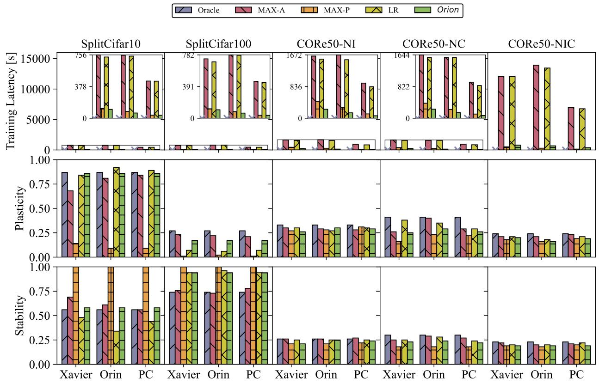

bar_stacked

| Dataset | Method | Oracle (Latency) | MAX-A (Latency) | MAX-P (Latency) | LR (Latency) | Orion (Latency) |
| :--- | :--- | :--- | :--- | :--- | :--- | :--- |
| SplitCifar10 | Oracle | ~800 | ~800 | ~800 | ~800 | ~800 |
| SplitCifar10 | MAX-A | ~756 | ~756 | ~1200 | ~756 | ~1200 |
| SplitCifar10 | MAX-P | ~800 | ~800 | ~1200 | ~756 | ~1200 |
| SplitCifar10 | LR | ~800 | ~391 | ~800 | ~391 | ~800 |
| SplitCifar10 | Orion | ~800 | ~391 | ~800 | ~391 | ~800 |
| SplitCifar100 | Oracle | ~800 | ~756 | ~800 | ~756 | ~800 |
| SplitCifar100 | MAX-A | ~756 | ~756 | ~1200 | ~756 | ~1200 |
| SplitCifar100 | MAX-P | ~800 | ~756 | ~1200 | ~756 | ~1200 |
| SplitCifar100 | LR | ~800 | ~391 | ~800 | ~391 | ~800 |
| SplitCifar100 | Orion | ~800 | ~391 | ~800 | ~391 | ~800 |
| CORe50-NI | Oracle | ~1672 | ~1672 | ~1672 | ~1672 | ~1672 |
| CORe50-NI | MAX-A | ~1672 | ~1672 | ~1672 | ~1672 | ~1672 |
| CORe50-NI | MAX-P | ~1672 | ~1672 | ~1672 | ~1672 | ~1672 |
| CORe50-NI | LR | ~1672 | ~836 | ~836 | ~836 | ~836 |
| CORe50-NI | Orion | ~1672 | ~836 | ~836 | ~836 | ~836 |
| CORe50-NC | Oracle | ~1644 | ~1644 | ~1644 | ~1644 | ~1644 |
| CORe50-NC | MAX-A | ~1644 | ~1644 | ~1644 | ~1644 | ~1644 |
| CORe50-NC | MAX-P | ~1644 | ~1644 | ~1644 | ~1644 | ~1644 |
| CORe50-NC | LR | ~1644 | ~822 | ~822 | ~822 | ~822 |
| CORe50-NC | Orion | ~1644 | ~822 | ~822 | ~822 | ~822 |
| CORe50-NIC | Oracle | ~1350 | ~1350 | ~1350 | ~1350 | ~1350 |
| CORe50-NIC | MAX-A | ~1350 | ~1350 | ~1350 | ~1350 | ~1350 |
| CORe50-NIC | MAX-P | ~1350 | ~1350 | ~1350 | ~1350 | ~1350 |
| CORe50-NIC | LR | ~1350 | ~1350 | ~1350 | ~1350 | ~1350 |
| CORe50-NIC | Orion | ~1350 | ~756 | ~756 | ~756 | ~756 |

Data values are estimated from bar heights as no explicit data labels are provided on the bars. The 'OR' suffix in the original chart indicates that the legend applies to all four methods.

Figure 4: Overall effectiveness of Orion using the ER algorithm evaluated on five benchmarks. Crosses indicate OOM.

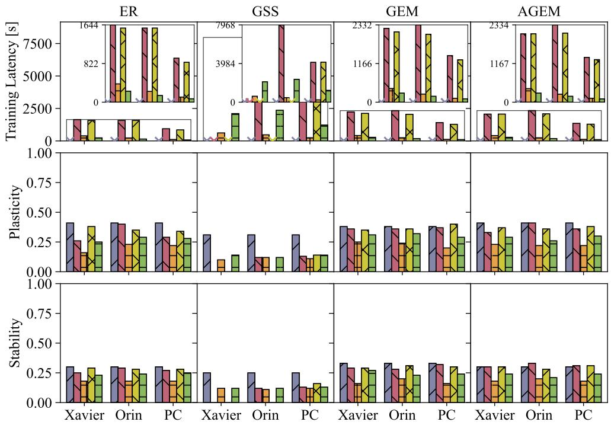

bar_stacked

| Dataset | Model | Condition 1 (Blue) | Condition 2 (Orange) | Condition 3 (Red) | Condition 4 (Green) | Condition 5 (Yellow) | Condition 6 (Purple) |
| :--- | :--- | :--- | :--- | :--- | :--- | :--- | :--- |
| ER | Xavier | ~0.42 | ~0.26 | ~0.26 | ~0.16 | ~0.38 | ~0.25 |
| ER | Orin | ~0.42 | ~0.41 | ~0.41 | ~0.23 | ~0.35 | ~0.29 |
| ER | PC | ~0.42 | ~0.29 | ~0.29 | ~0.29 | ~0.34 | ~0.29 |
| GSS | Xavier | ~0.31 | ~0.10 | ~0.10 | ~0.14 | ~0.14 | ~0.31 |
| GSS | Orin | ~0.31 | ~0.13 | ~0.13 | ~0.13 | ~0.13 | ~0.25 |
| GSS | PC | ~0.31 | ~0.13 | ~0.13 | ~0.13 | ~0.14 | ~0.25 |
| GEM | Xavier | ~0.38 | ~0.37 | ~0.37 | ~0.25 | ~0.35 | ~0.38 |
| GEM | Orin | ~0.38 | ~0.36 | ~0.36 | ~0.25 | ~0.36 | ~0.38 |
| GEM | PC | ~0.38 | ~0.37 | ~0.37 | ~0.25 | ~0.41 | ~0.38 |
| AGEM | Xavier | ~0.41 | ~0.33 | ~0.33 | ~0.22 | ~0.37 | ~0.41 |
| AGEM | Orin | ~0.41 | ~0.41 | ~0.41 | ~0.25 | ~0.36 | ~0.41 |
| AGEM | PC | ~0.41 | ~0.36 | ~0.36 | ~0.25 | ~0.38 | ~0.41 |

Data values are estimated from bar heights relative to the y-axis scale (Stability, Plasticity, Training Latency [s]). Exact numerical labels are not provided for individual bars; values in the table are estimated based on gridlines.

Figure 5: Overall effectiveness of Orion on four OCL algorithms on the CORe50-NC benchmark. Crosses indicate OOM.

# 5.2 Overall Effectiveness

This section evaluates the effectiveness of Orion across three platforms, benchmarks, and OCL algorithms. The evaluation is divided into three subsets: (1) performance across benchmarks using a state-of-the-art OCL algorithm, (2) performance across representative OCL algorithms on a single benchmark, and (3) performance under various user-specified preferences for different metrics, highlighting trade-offs between training latency, plasticity, and stability.

# 5.2.1 Performance across Benchmarks.

We evaluate the performance of Orion across five benchmarks of varying sizes. We focus ER [1] herein since it is the most representative replay-based OCL algorithm among the four algorithms.

Training Latency. As seen in Fig. 4, Orion runs significantly faster by an average of 392.04× compared with the offline approach Oracle. This huge improvement is due to Oracle requiring extensive 42 offline runs, while Orion could optimize the OCL systems in a single run. Compared with online approaches, Orion also demonstrates supreme latency performance. Orion exhibits significantly lower training latency than both MAX-A and LR across all benchmarks, achieving an average speedup of 12.13× and 11.69×, respectively. Furthermore, Orion even outperforms MAX-P in training latency on small and medium benchmarks (4 out of 5 benchmarks), achieving an average 1.43× speedup due to Orion's efficient implementation and seamless integration within the OCL systems. On the large CORe50-NIC benchmark, Orion incurs slightly higher latency, averaging 116.05% of MAX-P, which is optimized solely for training latency.

Plasticity and Stability. On small benchmarks, Orion trades off more on plasticity by 12.0% compared to MAX-A but outperforms stability than MAX-A by 19.9%. Orion also outperforms LR on plasticity and

Table 3: Overall effectiveness of Orion under different user preferences on ER algorithms on NVIDIA Jetson AGX Xavier. The arrow directions indicate better performance metrics. The best results are highlighted in bold. Differences compared to the best results are written in the subscription.

<table><tr><td>Baselines</td><td>Prefer Latency</td><td>Balanced</td><td>Prefer P/S</td></tr><tr><td>Metrics</td><td colspan="3">Training Latency [s] ↓</td></tr><tr><td>SplitCIFAR10</td><td>88.21</td><td> $106.06_{+17.85}$ </td><td> $117.61_{+29.40}$ </td></tr><tr><td>SplitCIFAR100</td><td>86.72</td><td> $104.65_{+17.93}$ </td><td> $117.07_{+30.35}$ </td></tr><tr><td>CORe50-NI</td><td>209.44</td><td> $237.39_{+27.95}$ </td><td> $277.53_{+68.09}$ </td></tr><tr><td>CORe50-NC</td><td>219.81</td><td> $235.02_{+15.21}$ </td><td> $357.24_{+137.43}$ </td></tr><tr><td>CORe50-NIC</td><td>519.89</td><td> $786.18_{+266.29}$ </td><td> $1097.33_{+577.44}$ </td></tr><tr><td>Metrics</td><td colspan="3">Plasticity ↑</td></tr><tr><td>SplitCIFAR10</td><td> $0.51_{-0.35}$ </td><td>0.86</td><td>0.86</td></tr><tr><td>SplitCIFAR100</td><td> $0.08_{-0.10}$ </td><td> $0.17_{-0.01}$ </td><td>0.18</td></tr><tr><td>CORe50-NI</td><td> $0.27_{-0.05}$ </td><td> $0.26_{-0.06}$ </td><td>0.32</td></tr><tr><td>CORe50-NC</td><td> $0.24_{-0.10}$ </td><td> $0.25_{-0.09}$ </td><td>0.34</td></tr><tr><td>CORe50-NIC</td><td> $0.17_{-0.07}$ </td><td> $0.20_{-0.04}$ </td><td>0.24</td></tr><tr><td>Metrics</td><td colspan="3">Stability ↑</td></tr><tr><td>SplitCIFAR10</td><td> $0.55_{-0.16}$ </td><td> $0.58_{-0.13}$ </td><td>0.71</td></tr><tr><td>SplitCIFAR100</td><td> $0.94_{-0.02}$ </td><td> $0.94_{-0.02}$ </td><td>0.96</td></tr><tr><td>CORe50-NI</td><td> $0.21_{-0.06}$ </td><td> $0.21_{-0.06}$ </td><td>0.27</td></tr><tr><td>CORe50-NC</td><td> $0.21_{-0.05}$ </td><td> $0.23_{-0.03}$ </td><td>0.26</td></tr><tr><td>CORe50-NIC</td><td> $0.15_{-0.11}$ </td><td> $0.19_{-0.07}$ </td><td>0.26</td></tr></table>

stability on average by 52.3% and 37.4%. According to MAX-P, Orion significantly outperforms it by 9.43× on plasticity, but notably, tradeoffs on the stability of MAX-P on average by 24.0%. These counter-intuitive results could be explained by the definition plasticity, which indicates the ability to learn new knowledge and stability to resist forgetting $^{1}$ , MAX-P learns very little new knowledge (low plasticity value near to zero) that can be forgotten, so it should have higher stability. Compared with offline baseline Oracle, Orion performs competitively on small benchmarks. For SplitCIFAR10, Orion achieves only a 1.15% plasticity gap compared to Oracle while surpassing it by 3.57% in stability. These results highlight that Orion's online adaptability allows it to perform near or even beyond the offline baseline on smaller benchmarks.

On medium and large benchmarks, Orion demonstrates strong performance in plasticity and stability. It outperforms MAX-P by an average of 15.6% in plasticity and 11.9% in stability. However, compared to MAX-A and LR, Orion trades off plasticity/stability by 11.2%/16.1% and 13.1%/5.7%, respectively, while achieving much faster adaptation. Oracle shows a more significant advantage on medium and large benchmarks, achieving an average plasticity of 0.28 and stability of 0.33, compared to Orion's 0.22 and 0.30, despite this, Orion remains competitive in stability, staying within 10% of Oracle on average. The trade-offs in plasticity become more pronounced as benchmark size increases, suggesting that online methods like Orion could benefit from parameter tuning and further refinement for larger-scale scenarios.

# 5.2.2 Performance across OCL Algorithms.

Fig. 5 shows the performance of the evaluated methods across four representative OCL algorithms with heterogeneous computation complexity and memory usage. We used the CORe50-NC because it is medium-sized and represents typical resource requirements for OCL benchmarks.

Training Latency. Orion achieves an average speedup of 267.64× over the offline Oracle, which requires 42 runs, by optimizing OCL systems online in a single self-adaptive run. Notably, Oracle encounters OOM errors in all algorithms except ER due to its high memory requirements, making it impractical for resource-constrained scenarios. Compared to online approaches, Orion achieves significant average speedups of 8.87×, 8.31×, and 1.13× over MAX-A, LR, and MAX-P, respectively, demonstrating efficient adaptation across diverse OCL algorithms. For GSS, the most computationally demanding algorithm, MAX-A, and LR face OOM errors on the Xavier platform, and LR encounters OOM errors on the Orin platform. In contrast, Orion successfully executes GSS in all scenarios, albeit with a 349.05% higher training latency compared to MAX-P. These results highlight Orion's versatility in handling challenging scenarios, ensuring execution across all OCL algorithms without OOM errors, even under stringent resource constraints.

Plasticity and Stability. Orion maintains strong plasticity and stability across all four OCL algorithms. It significantly outperforms MAX-P by 28.1% in plasticity and 27.6% in stability, while trading off plasticity/stability by 13.0%/16.6% and 15.9%/13.8% compared to MAX-A and LR, respectively, with much faster adaptation. Compared to Oracle, Orion demonstrates greater robustness and usability, avoiding the critical reliability issues that hinder Oracle in practical settings, where it encounters 11 OOM errors across 42 runs. Importantly, Orion successfully executes all algorithms while achieving comparable performance to Oracle, with an average plasticity/stability trade-off of 9.5% and 8.3%, respectively, making it a reliable alternative under memory constraints.

The GSS algorithm, with the highest memory complexity, causes OOM errors for MAX-A and LR on the Xavier platform and for LR on the Orin platform. In contrast, Orion successfully executes GSS without OOM errors, outperforming MAX-P in plasticity/stability by 40.0%/0.0% on Xavier and 0.0%/9.1% on Orin. On an edge server with richer resources, Orion achieves the best plasticity among all online baselines, outperforming MAX-P by 8.3% and matching MAX-A, while trading off stability against LR by 18.75%. These findings indicate that Orion effectively balances plasticity and stability across a wide range of hardware setups and resource conditions. This adaptability underscores Orion's ability to perform reliably and efficiently across diverse OCL scenarios, making it a practical and robust solution for real-world deployments.

# 5.2.3 Performance across user-specific preferences.

Approach is designed to be versatile in handling different constraint scenarios based on user-specified preferences for certain performance metrics. To evaluate the adaptability of Orion to different user preferences, we assess its performance under three scenarios: (1) Prefer Latency, where the user prioritizes training latency; (2) Balanced, where the user assigns equal importance to all metrics; and (3) Prefer P/S, where the user prioritizes plasticity and stability. We focus on the ER algorithm and evaluate its performance on Xavier across five benchmarks. Tab. 3 presents the results of Orion under these three user preference scenarios. When the user prefers low training latency, Orion achieves the lowest latency across all benchmarks, with an average latency of 224.81 seconds. However, this comes at the cost of lower plasticity and stability, with average values of 0.25 and 0.42, respectively. In the balanced scenario, Orion strikes a good balance between training latency, plasticity, and stability. It achieves an average training latency of 293.86 seconds, which is $30.7\%$ higher than the Prefer Latency scenario. However, it maintains acceptable plasticity and stability, with average values of 0.32 and 0.43, respectively. When the user prefers high plasticity and stability (Prefer P/S), Orion achieves the best plasticity and stability across all benchmarks, averaged by 0.36 and 0.52. However, this comes at the cost of higher training latency, with an average of 393.36 seconds, $1.34 \times$ higher than the balanced scenarios. These results demonstrate Orion's ability to adapt to different user preferences and optimize its performance.

Table 4: Robotic case study results on NVIDIA Jetson Xavier. ✗ indicates out-of-memory error occurs. The arrow directions indicate better performance metrics. IC: Incremental Class, IL: Incremental Illumination, WC: Weather Change.

<table><tr><td>Algorithms</td><td colspan="4">ER</td><td colspan="4">GSS</td><td colspan="4">GEM</td><td colspan="4">AGEM</td></tr><tr><td>Baselines</td><td>MAX-A</td><td>MAX-P</td><td>LR</td><td>Orion</td><td>MAX-A</td><td>MAX-P</td><td>LR</td><td>Orion</td><td>MAX-A</td><td>MAX-P</td><td>LR</td><td>Orion</td><td>MAX-A</td><td>MAX-P</td><td>LR</td><td>Orion</td></tr><tr><td>Metrics</td><td colspan="16">Training Latency [s] ↓</td></tr><tr><td>IC</td><td>203.45</td><td>X</td><td>204.30</td><td>111.98</td><td>X</td><td>X</td><td>X</td><td>436.07</td><td>233.24</td><td>X</td><td>234.98</td><td>122.29</td><td>229.82</td><td>X</td><td>235.74</td><td>111.02</td></tr><tr><td>IL</td><td>990.80</td><td>X</td><td>995.93</td><td>416.97</td><td>X</td><td>X</td><td>X</td><td>1169.56</td><td>1195.18</td><td>X</td><td>1201.09</td><td>444.75</td><td>1177.83</td><td>X</td><td>1182.66</td><td>432.37</td></tr><tr><td>WC</td><td>1040.45</td><td>X</td><td>1035.50</td><td>435.02</td><td>X</td><td>X</td><td>X</td><td>1183.83</td><td>1240.66</td><td>X</td><td>1235.39</td><td>463.93</td><td>1239.03</td><td>X</td><td>1235.22</td><td>454.81</td></tr><tr><td>Metrics</td><td colspan="16">Plasticity ↑</td></tr><tr><td>IC</td><td>0.99</td><td>X</td><td>0.25</td><td>0.97</td><td>X</td><td>X</td><td>X</td><td>0.86</td><td>0.76</td><td>X</td><td>0.25</td><td>0.76</td><td>0.84</td><td>X</td><td>0.25</td><td>0.74</td></tr><tr><td>IL</td><td>0.98</td><td>X</td><td>0.99</td><td>0.81</td><td>X</td><td>X</td><td>X</td><td>0.98</td><td>0.97</td><td>X</td><td>0.95</td><td>0.90</td><td>0.98</td><td>X</td><td>0.95</td><td>0.80</td></tr><tr><td>WC</td><td>0.95</td><td>X</td><td>0.96</td><td>0.85</td><td>X</td><td>X</td><td>X</td><td>0.89</td><td>0.91</td><td>X</td><td>0.96</td><td>0.74</td><td>0.93</td><td>X</td><td>0.81</td><td>0.79</td></tr><tr><td>Metrics</td><td colspan="16">Stability ↑</td></tr><tr><td>IC</td><td>0.92</td><td>X</td><td>0.99</td><td>0.36</td><td>X</td><td>X</td><td>X</td><td>0.38</td><td>1.00</td><td>X</td><td>0.99</td><td>0.68</td><td>0.85</td><td>X</td><td>1.00</td><td>0.83</td></tr><tr><td>IL</td><td>1.00</td><td>X</td><td>0.99</td><td>0.91</td><td>X</td><td>X</td><td>X</td><td>1.00</td><td>1.00</td><td>X</td><td>1.00</td><td>1.00</td><td>1.00</td><td>X</td><td>1.00</td><td>1.00</td></tr><tr><td>WC</td><td>1.00</td><td>X</td><td>1.00</td><td>0.99</td><td>X</td><td>X</td><td>X</td><td>0.90</td><td>1.00</td><td>X</td><td>1.00</td><td>1.00</td><td>1.00</td><td>X</td><td>1.00</td><td>1.00</td></tr></table>

Overall effectiveness and versatility: Orion effectively auto-balances training latency, plasticity, and stability across various benchmarks, OCL algorithms, and user-specified preferences while consistently adhering to memory constraints on different hardware platforms. This versatility ensures optimal performance tailored to specific system requirements and user needs.

# 5.3 Robotic Case Study

To evaluate the practicality of Orion, we conducted a case study using a Jetson-enabled autonomous navigation robot, built on the Turtlebot3 Burger [39] with an NVIDIA Jetson motherboard and a high-resolution camera for real-time data processing and navigation (Fig. 6). Using Endless-Sim [26], we tested Orion in three realistic OCL scenarios (Tab. 4). The results show that Orion effectively balances training latency, plasticity, and stability without any OOM errors. In contrast, baseline methods experienced 3, 12, and 3 OOM errors for MAX-A, MAX-P, and LR, respectively. These findings demonstrate Orion's suitability for autonomous robotics applications with stringent memory constraints.

To gain deeper insights into Orion's handling of memory-constrained scenarios, we performed a detailed breakdown and time profiling of memory usage for GSS, as shown in Fig. 7. The left plot shows the memory breakdown by usage categories, revealing that MAX-A and LR heavily consume memory in data storage, while MAX-P uses excessive memory for intermediate activations, leading to OOM errors. In contrast, Orion auto-balances memory usage, ensuring smooth execution without exceeding available memory. The right plot in Fig. 7 presents a system-level memory usage profile over time for GSS. MAX-P quickly runs out of memory during batch executions, while MAX-A and LR last longer but eventually encounter OOM errors due to uncontrolled storage. Conversely, Orion maintains a stable memory footprint throughout training, demonstrating its practicality in real-world OCL applications.

Practical usability: Orion effectively auto-balances training latency, plasticity, and stability without out-of-memory errors in practical robotic scenarios.

# 5.4 Ablation Study

Data prefetching optimizes data loading without altering training parameters or the DNN model, thus preserving plasticity and stability unchanged. As shown in Fig. 8, data prefetching reduces training latency by $32.3\%$ , $36.7\%$ , and $37.6\%$ on Xavier, Orin, and Server, respectively, demonstrating greater benefits for platforms with higher computational capabilities. The ablation studies demonstrate the effectiveness of Orion's modular design and system prototyping. The seamless integration of these components enables

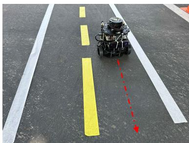

natural_image

Robot on a road with yellow and white painted stripes and red dashed lines (no text or symbols visible)

(a) Clean Road

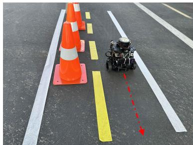

natural_image

Road intersection with a robotic vehicle and orange traffic cone on asphalt (no text or symbols visible)

(b) Road Work Zone

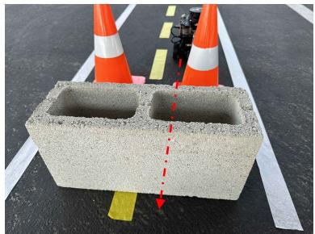

natural_image

Concrete block with orange and white conical cones placed on a road, marked with yellow and red arrows (no text or symbols visible)

(c) Closed Road

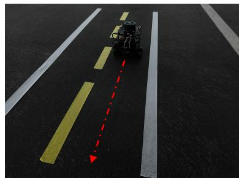

natural_image

Road marking with a red dashed line and yellow lane markings, no visible text or symbols

(d) Night light

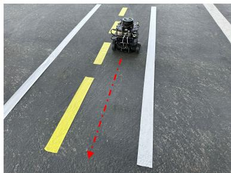

natural_image

Robot on a road with yellow and white lane markings, no visible text or symbols

(e) Morning light

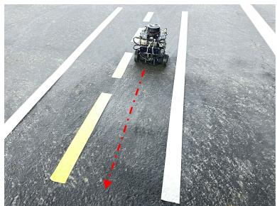

natural_image

A robotic vehicle driving on a multi-lane road with yellow and white lane markings (no text or symbols visible)

(e) Noon light

Figure 6: A realistic case study based on an NVIDIA Jetson GPU-enabled autonomous navigation robot built on Turtlebot3. (a) (b) (c) exhibit incremental class scenarios (IC), (d) (e) (f) exhibit incremental light scenarios (IL). Red lines indicate the robot's moving directions.  
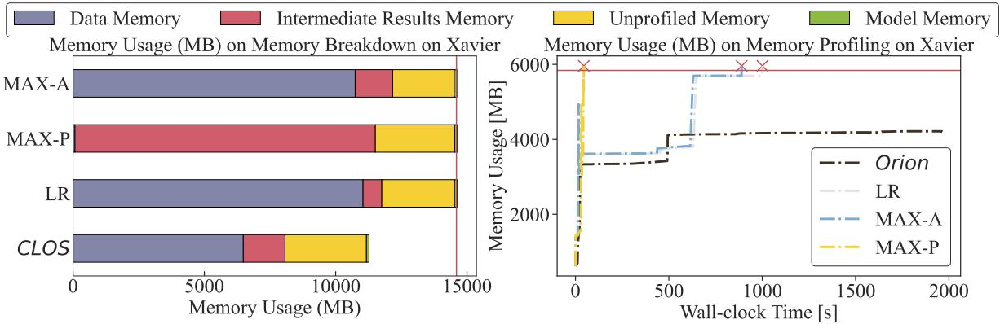

bar_stacked

| Category | Data Memory (MB) | Intermediate Results Memory (MB) | Unprofiled Memory (MB) | Model Memory (MB) |
| --- | --- | --- | --- | --- |
| MAX-A | ~10800 | ~1500 | ~2300 | ~1450 |
| MAX-P | ~11500 | ~9500 | ~2500 | ~1450 |
| LR | ~11000 | ~800 | ~2700 | ~1450 |
| CLOS | ~6500 | ~1500 | ~2800 | ~1150 |

Figure 7: Left: Memory breakdown on GSS algorithm in the case study. The red line represents Xavier's maximum memory. Right: System-level memory usage profiling for GSS algorithm. The red line represents Xavier's maximum memory. Red crosses indicate the OOM point.

Orion to achieve substantial gains in training latency performance while maintaining acceptable plasticity and stability.

# 5.5 Overhead Analysis

Execution Overhead. As shown in Tab. 5, the overall execution overhead of Orion remains below 2.1% of the total execution time, demonstrating its efficiency. Overhead from the URGE calculator, finer-grained controller, and data prefetching scales linearly with the number of experiences. There is some unprofiled execution overhead while remaining nearly unchanged, coming from the OCL framework itself.

Memory Overhead. Tab. 7 shows that Orion maintains a memory overhead of less than 1.0% across all platforms. Minor overhead arises from score calculation, finer-grained control, and selective approximation, with data prefetching contributing the most.

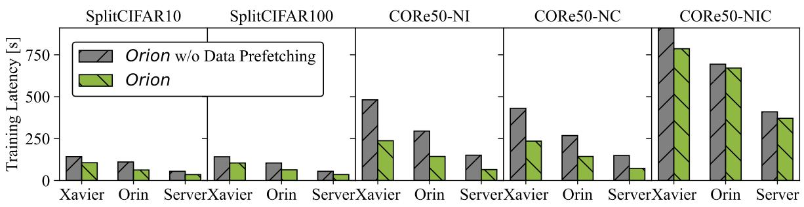

bar

| Category | Model | Orion w/o Data Prefetching (Training Latency [s]) | Orion (Training Latency [s]) |
| --- | --- | --- | --- |
| SplitCIFAR10 | Xavier | ~140 | ~100 |
| SplitCIFAR10 | Orin | ~110 | ~60 |
| SplitCIFAR10 | Server | ~50 | ~30 |
| SplitCIFAR100 | Xavier | ~140 | ~100 |
| SplitCIFAR100 | Orin | ~100 | ~60 |
| SplitCIFAR100 | Server | ~50 | ~30 |
| CORe50-NI | Xavier | ~480 | ~240 |
| CORe50-NI | Orin | ~300 | ~140 |
| CORe50-NI | Server | ~150 | ~60 |
| CORe50-NC | Xavier | ~430 | ~230 |
| CORe50-NC | Orin | ~270 | ~140 |
| CORe50-NC | Server | ~150 | ~70 |
| CORe50-NIC | Xavier | >900 | ~780 |
| CORe50-NIC | Orin | ~700 | ~670 |
| CORe50-NIC | Server | ~410 | ~370 |

Figure 8: Ablation study of data prefetching.

Table 5: Average runtime execution overhead [ms] and percentage of Orion across benchmarks on Xavier.

<table><tr><td>Benchmark</td><td>Calculator</td><td>Control</td><td>Prefetch</td><td>Overall</td></tr><tr><td>SplitCIFAR10</td><td>18 (0.02%)</td><td>2 (0.01%)</td><td>190 (0.18%)</td><td>2210 (2.10%)</td></tr><tr><td>SplitCIFAR100</td><td>18 (0.02%)</td><td>2 (0.01%)</td><td>195 (0.18%)</td><td>2215 (2.10%)</td></tr><tr><td>CORe50-NI</td><td>14 (0.01%)</td><td>8 (0.01%)</td><td>156 (0.07%)</td><td>2178 (0.93%)</td></tr><tr><td>CORe50-NC</td><td>17 (0.01%)</td><td>8 (0.01%)</td><td>176 (0.07%)</td><td>2201 (0.94%)</td></tr><tr><td>CORe50-NIC</td><td>144 (0.02%)</td><td>16 (0.01%)</td><td>1540 (0.20%)</td><td>3700 (0.47%)</td></tr></table>

Table 6: Average energy execution overhead [Joules] of Orion across benchmarks on Xavier.

<table><tr><td>Benchmark</td><td>Calculator</td><td>Control</td><td>Prefetch</td><td>Overall</td></tr><tr><td>SplitCIFAR10</td><td>0.27</td><td>0.03</td><td>2.85</td><td>33.15</td></tr><tr><td>SplitCIFAR100</td><td>0.27</td><td>0.03</td><td>2.93</td><td>33.23</td></tr><tr><td>CORe50-NI</td><td>0.21</td><td>0.12</td><td>2.34</td><td>32.67</td></tr><tr><td>CORe50-NC</td><td>0.26</td><td>0.12</td><td>2.64</td><td>33.02</td></tr><tr><td>CORe50-NIC</td><td>2.16</td><td>0.24</td><td>23.10</td><td>55.50</td></tr></table>

Table 7: Memory overhead of Orion.

<table><tr><td></td><td colspan="3">(a) Overhead Breakdown on Module</td><td colspan="3">(b) Overall Overhead Ratio</td></tr><tr><td>Benchmark</td><td>Calculator</td><td>Control</td><td>Prefetch</td><td>Xavier</td><td>Orin</td><td>Server</td></tr><tr><td>SplitCIFAR10</td><td>1 KB</td><td>10 KB</td><td>3.2MB</td><td>0.041%</td><td>0.021%</td><td>0.016%</td></tr><tr><td>SplitCIFAR100</td><td>1 KB</td><td>10 KB</td><td>3.2MB</td><td>0.041%</td><td>0.021%</td><td>0.016%</td></tr><tr><td>CORe50-NI</td><td>1 KB</td><td>8 KB</td><td>3.2MB</td><td>0.041%</td><td>0.021%</td><td>0.016%</td></tr><tr><td>CORe50-NC</td><td>1 KB</td><td>9 KB</td><td>3.2MB</td><td>0.041%</td><td>0.021%</td><td>0.016%</td></tr><tr><td>CORe50-NIC</td><td>2 KB</td><td>79 KB</td><td>3.2MB</td><td>0.042%</td><td>0.021%</td><td>0.017%</td></tr></table>

Energy Overhead. Tab. 6 shows that Orion maintains a memory overhead of less than 0.1% across all platforms. Negligible overhead arises from all components.

Low overhead: Orion's highly optimized implementation introduces negligible computational, memory burdens, and energy consumption, establishing it as a lightweight, deployable solution for sustainable on-device OCL.

# 5.6 Discussions

Limitations. This work focuses on replay-based OCL under stringent memory constraints, excluding non-replay-based approaches $[6, 7]$ . We do not address OCL for natural language processing tasks, large-scale datasets like ImageNet $[40]$ and CLOC $[41]$ , or infinite streams $[42, 43]$ , which remain future work due to resource limitations. Following existing continual learning work $[1–3]$ , we assume data labels are available for supervised learning, as unsupervised continual learning remains a theoretical challenge. Notably, server-based solutions using large, highly accurate “golden models” $[18]$ could provide annotations, but they are impractical for on-device memory-constrained scenarios due to high memory resource demands.

Generality and Broader Impact. Orion is highly adaptable across diverse datasets, models, and hardware. Built atop Avalanche-lib [21, 22], it seamlessly integrates with scalable DNN training solutions [44–48] for both traditional and resource-constrained environments. Beyond navigational robotics, Orion's modular and transparent architecture readily extends to other on-device scenarios, including video analytics [18], fault diagnosis [49], user personalization [50–52], home automation [52, 53], and smart wearables [54]. Furthermore, Orion is orthogonal to and fully compatible with existing efficiency techniques. At the model level, it supports automated porting [55], model merging [56], compression [57–63], and quantization [64–66]. At the system level, it can integrate memory-saving optimizations like gradient checkpointing [67, 68], micro-batch execution [69, 70], recomputation [70, 71], and selective layer updates [72–74]. While our current evaluation relies on the standard ResNet-20 backbone for fair algorithmic comparison, validating our self-adaptive memory policies across a broader spectrum of modern model architectures remains important future work. Ultimately, we hope the engineering insights and design trade-offs will guide improvements in other prominent OCL frameworks [75–77], facilitating the practical, widespread deployment of continual learning systems.

# 6 Related Work

Online Continual Learning (OCL) addresses the challenge of sequential learning from streaming data $[1–8, 10–12, 78]$ . Replay-based methods, such as ER $[1]$ , mitigate catastrophic forgetting by revisiting past experiences during new task learning $[1–5, 15]$ . These methods perform well across diverse settings and are particularly effective in resource-constrained environments $[2]$ . GEM $[3]$ and AGEM $[4]$ preserve prior knowledge using gradient-based constraints, while GSS $[5]$ enhances memory efficiency by storing informative samples. These approaches balance memory retention and adaptability. In practice, OCL serves as an efficient framework for continuous robotic adaptation. It enables autonomous systems to seamlessly adjust to changing lighting and terrains, perform real-time novel object recognition $[19]$ , dynamically update person re-identification models across shifting environments $[29]$ , and incrementally perfect physical manipulation tasks $[30]$ .

Few studies explore system-level optimization for continual learning. For instance, LifeLearner $[17]$ focuses on hardware-level optimization for meta-continual learning, addressing a distinct problem scope. Ekya $[18]$ optimizes offline continual learning, e.g., iCaRL $[78]$ , for video analytics on high-end multi-GPU servers via dynamic workload scheduling, targeting different systems and applications. Latent Replay $[19]$ , which only modifies algorithms without considering system-level optimization, serves as a strong baseline in our evaluation.

Unlike these prior efforts, which either isolate algorithmic improvements from hardware realities or target resource-rich offline environments, Orion explicitly bridges the gap between OCL algorithms and edge system constraints. To the best of our knowledge, Orion is the first comprehensive framework to dynamically co-optimize latency, energy efficiency, and learning efficacy for online continual learning on embedded platforms. This enables sustainable, real-time robotic adaptation without exceeding the strict memory constraints inherent to low-power SoCs.

# 7 Conclusion

This paper presents Orion, a holistic solution for managing training latency, plasticity, and stability in on-device OCL for memory-limited autonomous embedded systems. Our study highlights the trade-offs required in OCL systems on resource-constrained platforms. Orion effectively auto-balances these trade-offs while adhering to memory constraints. We evaluate Orion across state-of-the-art replay-based OCL algorithms, diverse benchmarks, and three heterogeneous hardware platforms, demonstrating its effectiveness and versatility. Although we focus on replay-based OCL algorithms, we believe the design principles of Orion can extend to other continual learning systems, laying a foundation for future on-device OCL systems in intelligent systems.

# References

[1] Arslan Chaudhry, Marcus Rohrbach, Mohamed Elhoseiny, Thalaiyasingam Ajanthan, P Dokania, P Torr, and M Ranzato. Continual learning with tiny episodic memories. In Workshop on Multi-Task and Lifelong Reinforcement Learning, 2019.  
[2] Ameya Prabhu, Hasan Abed Al Kader Hammoud, Puneet K Dokania, Philip HS Torr, Ser-Nam Lim, Bernard Ghanem, and Adel Bibi. Computationally budgeted continual learning: What does matter? In Proceedings of the IEEE/CVF Conference on Computer Vision and Pattern Recognition, pages 3698–3707, 2023.  
[3] David Lopez-Paz and Marc'Aurelio Ranzato. Gradient episodic memory for continual learning. Advances in neural information processing systems, 30, 2017.  
[4] Arslan Chaudhry, Marc'Aurelio Ranzato, Marcus Rohrbach, and Mohamed Elhoseiny. Efficient lifelong learning with a-gem. arXiv preprint arXiv:1812.00420, 2018.  
[5] Rahaf Aljundi, Min Lin, Baptiste Goujaud, and Yoshua Bengio. Gradient based sample selection for online continual learning. Advances in neural information processing systems, 32, 2019.  
[6] James Kirkpatrick, Razvan Pascanu, Neil Rabinowitz, Joel Veness, Guillaume Desjardins, Andrei A Rusu, Kieran Milan, John Quan, Tiago Ramalho, Agnieszka Grabska-Barwinska, et al. Overcoming catastrophic forgetting in neural networks. Proceedings of the national academy of sciences, 114(13):3521–3526, 2017.  
[7] Zhizhong Li and Derek Hoiem. Learning without forgetting. IEEE transactions on pattern analysis and machine intelligence, 40(12):2935–2947, 2017.  
[8] Albin Soutif-Cormerais, Antonio Carta, Andrea Cossu, Julio Hurtado, Vincenzo Lomonaco, Joost Van de Weijer, and Hamed Hemati. A comprehensive empirical evaluation on online continual learning. In Proceedings of the IEEE/CVF International Conference on Computer Vision, pages 3518–3528, 2023.  
[9] Xiangli Nie, Zhiguang Deng, Mingdong He, Mingyu Fan, and Zheng Tang. Online active continual learning for robotic lifelong object recognition. IEEE Transactions on Neural Networks and Learning Systems, 2023.  
[10] Niclas Vödisch, Daniele Cattaneo, Wolfram Burgard, and Abhinav Valada. Covio: Online continual learning for visual-inertial odometry. In Proceedings of the IEEE/CVF Conference on Computer Vision and Pattern Recognition, pages 2464–2473, 2023.  
[11] Niclas Vödisch, Kürsat Petek, Wolfram Burgard, and Abhinav Valada. Codeps: Online continual learning for depth estimation and panoptic segmentation. arXiv preprint arXiv:2303.10147, 2023.  
[12] Luca Castri, Sariah Mghames, and Nicola Bellotto. From continual learning to causal discovery in robotics. In AAAI Bridge Program on Continual Causality, pages 85–91. PMLR, 2023.  
[13] Elvin Hajizada, Balachandran Swaminathan, and Yulia Sandamirskaya. Continual learning for autonomous robots: A prototype-based approach. arXiv preprint arXiv:2404.00418, 2024.  
[14] Zheda Mai, Ruiwen Li, Jihwan Jeong, David Quispe, Hyunwoo Kim, and Scott Sanner. Online continual learning in image classification: An empirical survey. Neurocomputing, 469:28–51, 2022.  
[15] Rahaf Aljundi, Eugene Belilovsky, Tinne Tuytelaars, Laurent Charlin, Massimo Caccia, Min Lin, and Lucas Page-Caccia. Online continual learning with maximal interfered retrieval. Advances in neural information processing systems, 32, 2019.  
[16] Yasir Ghunaim, Adel Bibi, Kumail Alhamoud, Motasem Alfarra, Hasan Abed Al Kader Hammoud, Ameya Prabhu, Philip HS Torr, and Bernard Ghanem. Real-time evaluation in online continual learning: A new hope. In Proceedings of the IEEE/CVF Conference on Computer Vision and Pattern Recognition, pages 11888–11897, 2023.  
[17] Young D Kwon, Jagmohan Chauhan, Hong Jia, Stylianos I Venieris, and Cecilia Mascolo. Lifelearner: Hardware-aware meta continual learning system for embedded computing platforms. arXiv preprint arXiv:2311.11420, 2023.  
[18] Romil Bhardwaj, Zhengxu Xia, Ganesh Ananthanarayanan, Junchen Jiang, Yuanchao Shu, Nikolaos Karianakis, Kevin Hsieh, Paramvir Bahl, and Ion Stoica. Ekya: Continuous learning of video analytics models on edge compute servers. In 19th USENIX Symposium on Networked Systems Design and Implementation (NSDI 22), pages 119–135, 2022.  
[19] Lorenzo Pellegrini, Gabriele Graffieti, Vincenzo Lomonaco, and Davide Maltoni. Latent replay for real-time continual learning. In 2020 IEEE/RSJ International Conference on Intelligent Robots and Systems (IROS), pages 10203–10209. IEEE, 2020.  
[20] Eugene Pleasants Odum, Gary W Barrett, et al. Fundamentals of ecology, volume 3. Saunders Philadelphia, 1971.  
[21] Antonio Carta, Lorenzo Pellegrini, Andrea Cossu, Hamed Hemati, and Vincenzo Lomonaco. Avalanche: A pytorch library for deep continual learning. Journal of Machine Learning Research, 24(363):1–6, 2023. URL http://jmlr.org/papers/v24/23-0130.html.  
[22] Vincenzo Lomonaco, Lorenzo Pellegrini, Andrea Cossu, Antonio Carta, Gabriele Graffieti, Tyler L. Hayes, Matthias De Lange, Marc Masana, Jary Pomponi, Gido van de Ven, Martin Mundt, Qi She, Keiland Cooper, Jeremy Forest, Eden Belouadah, Simone Calderara, German I. Parisi, Fabio Cuzzolin, Andreas Tolias, Simone Scardapane, Luca Antiga, Subutai Amhad, Adrian Popescu, Christopher Kanan, Joost van de Weijer, Tinne Tuytelaars, Davide Bacciu, and Davide Maltoni. Avalanche: an end-to-end library for continual learning. In Proceedings of IEEE Conference on Computer Vision and Pattern Recognition, 2nd Continual Learning in Computer Vision Workshop, 2021.  
[23] Alex Krizhevsky, Geoffrey Hinton, et al. Learning multiple layers of features from tiny images. 2009.  
[24] Vincenzo Lomonaco, Davide Maltoni, Lorenzo Pellegrini, et al. Fine-grained continual learning. arXiv preprint arXiv:1907.03799, 1, 2019.  
[25] V Lomanco and Davide Maltoni. Core50: a new dataset and benchmark for continual object recognition. In Proceedings of the 1st Annual Conference on Robot Learning, pages 17–26, 2017.  
[26] Timm Hess, Martin Mundt, Iuliia Pliushch, and Visvanathan Ramesh. A procedural world generation framework for systematic evaluation of continual learning. arXiv preprint arXiv:2106.02585, 2021.  
[27] NVIDIA. Jetson agx xavier. https://developer.nvidia.com/embedded/jetson-agx-xavier, 2020.  
[28] NVIDIA. Jetson agx orin. https://www.nvidia.com/en-us/autonomous-machines/embedded-systems/jetson-orin/, 2022.  
[29] Hanjing Ye, Jieting Zhao, Yu Zhan, Weinan Chen, Li He, and Hong Zhang. Person re-identification for robot person following with online continual learning. IEEE Robotics and Automation Letters, 2024.  
[30] Daehee Lee, Minjong Yoo, Woo Kyung Kim, Wonje Choi, and Honguk Woo. Incremental learning of retrievable skills for efficient continual task adaptation. Advances in Neural Information Processing Systems, 37:17286–17312, 2024.  
[31] Priya Goyal, Piotr Dollár, Ross Girshick, Pieter Noordhuis, Lukasz Wesolowski, Aapo Kyrola, Andrew Tulloch, Yangqing Jia, and Kaiming He. Accurate, large minibatch sgd: Training imagenet in 1 hour. arXiv preprint arXiv:1706.02677, 2017.  
[32] Shinpei Kato, Shota Tokunaga, Yuya Maruyama, Seiya Maeda, Manato Hirabayashi, Yuki Kitsukawa, Abraham Monrroy, Tomohito Ando, Yusuke Fujii, and Takuya Azumi. Autoware on board: Enabling autonomous vehicles with embedded systems. In 2018 ACM/IEEE 9th International Conference on Cyber-Physical Systems (ICCPS), pages 287–296. IEEE, 2018.  
[33] Branislav Kisačanin. Deep learning for autonomous vehicles. In 2017 IEEE 47th International Symposium on Multiple-Valued Logic (ISMVL), pages 142–142. IEEE, 2017.  
[34] Alexander Popov, Patrik Gebhardt, Ke Chen, Ryan Oldja, Heeseok Lee, Shane Murray, Ruchi Bhargava, and Nikolai Smolyanskiy. Nvradarnet: Real-time radar obstacle and free space detection for autonomous driving. arXiv preprint arXiv:2209.14499, 2022.  
[35] NVIDIA. Duckiebot (db-j). https://get.duckietown.com/products/duckiebot-db21, 2022.  
[36] NVIDIA. Sparkfun jetbot ai kit. https://www.sparkfun.com/products/18486, 2022.  
[37] NVIDIA. Waveshare jetbot ai kit. https://www.amazon.com/Waveshare-JetBot-AI-Kit-Accessories/dp/B07V8JL4TF/, 2022.  
[38] Kaiming He, Xiangyu Zhang, Shaoqing Ren, and Jian Sun. Deep residual learning for image recognition. In Proceedings of the IEEE conference on computer vision and pattern recognition, pages 770–778, 2016.  
[39] ROBOTIS. TurtleBot3 Overview. ROBOTIS, 2024. URL https://emanual.robotis.com/docs/en/platform/turtlebot3/overview/. Accessed: 15 April 2024.  
[40] Jia Deng, Wei Dong, Richard Socher, Li-Jia Li, Kai Li, and Li Fei-Fei. Imagenet: A large-scale hierarchical image database. In 2009 IEEE Conference on Computer Vision and Pattern Recognition, pages 248–255, 2009. doi: 10.1109/CVPR.2009.5206848.  
[41] Joohyung Kim, Janghun Hyeon, Hyunga Choi, Bumchul Jang, Bokyeon Jeong, and Nakju Doh. Cloc: Confident initial estimation of long-term visual localization using a few sequential images in large-scale spaces. IEEE Sensors Journal, 23(8):8613–8629, 2023. doi: 10.1109/JSEN.2023.3253872.  
[42] Fei Ye and Adrian G Bors. Continual variational autoencoder via continual generative knowledge distillation. In Proceedings of the AAAI Conference on Artificial Intelligence, volume 37, pages 10918–10926, 2023.  
[43] Wenxuan Zhang, Youssef Mohamed, Bernard Ghanem, Philip HS Torr, Adel Bibi, and Mohamed Elhoseiny. Continual learning on a diet: Learning from sparsely labeled streams under constrained computation. arXiv preprint arXiv:2404.12766, 2024.  
[44] Yimin Jiang, Yibo Zhu, Chang Lan, Bairen Yi, Yong Cui, and Chuanxiong Guo. A unified architecture for accelerating distributed {DNN} training in heterogeneous {GPU/CPU} clusters. In 14th USENIX Symposium on Operating Systems Design and Implementation (OSDI 20), pages 463–479, 2020.  
[45] Sanjith Athlur, Nitika Saran, Muthian Sivathanu, Ramachandran Ramjee, and Nipun Kwatra. Varuna: scalable, low-cost training of massive deep learning models. In Proceedings of the Seventeenth European Conference on Computer Systems, pages 472–487, 2022.  
[46] Jeffrey Dean, Greg Corrado, Rajat Monga, Kai Chen, Matthieu Devin, Mark Mao, Marc'aurelio Ranzato, Andrew Senior, Paul Tucker, Ke Yang, et al. Large scale distributed deep networks. Advances in neural information processing systems, 25, 2012.  
[47] Mohammad Shoeybi, Mostofa Patwary, Raul Puri, Patrick LeGresley, Jared Casper, and Bryan Catanzaro. Megatron-lm: Training multi-billion parameter language models using model parallelism. arXiv preprint arXiv:1909.08053, 2019.  
[48] Kazuki Osawa, Shigang Li, and Torsten Hoefler. Pipefisher: Efficient training of large language models using pipelining and fisher information matrices. Proceedings of Machine Learning and Systems, 5, 2023.  
[49] Youngjun Kim, Taewan Kim, Suhyun Kim, Seongjae Lee, and Taehyoun Kim. Design and implementation of a lightweight on-device ai-based real-time fault diagnosis system using continual learning. IEMEK Journal of Embedded Systems and Applications, 19(3):151–158, 2024.  
[50] Jagmohan Chauhan, Young D Kwon, Pan Hui, and Cecilia Mascolo. Contauth: Continual learning framework for behavioral-based user authentication. Proceedings of the ACM on Interactive, Mobile, Wearable and Ubiquitous Technologies, 4(4):1–23, 2020.  
[51] Anuj Diwan, Ching-Feng Yeh, Wei-Ning Hsu, Paden Tomasello, Eunsol Choi, David Harwath, and Abdelrahman Mohamed. Continual learning for on-device speech recognition using disentangled conformers. In ICASSP 2023-2023 IEEE International Conference on Acoustics, Speech and Signal Processing (ICASSP), pages 1–5. IEEE, 2023.  
[52] Lorenzo Pellegrini, Vincenzo Lomonaco, Gabriele Graffieti, and Davide Maltoni. Continual learning at the edge: Real-time training on smartphone devices. arXiv preprint arXiv:2105.13127, 2021.  
[53] Yuqing Zhao, Divya Saxena, and Jiannong Cao. Memory-efficient domain incremental learning for internet of things. In Proceedings of the 20th ACM Conference on Embedded Networked Sensor Systems, pages 1175–1181, 2022.  
[54] Martin Schiemer, Lei Fang, Simon Dobson, and Juan Ye. Online continual learning for human activity recognition. Pervasive and Mobile Computing, 93:101817, 2023.  
[55] Peizhen Guo, Bo Hu, and Wenjun Hu. Mistify: Automating {DNN} model porting for {On-Device} inference at the edge. In 18th USENIX Symposium on Networked Systems Design and Implementation (NSDI 21), pages 705–719, 2021.  
[56] Arthi Padmanabhan, Neil Agarwal, Anand Iyer, Ganesh Ananthanarayanan, Yuanchao Shu, Nikolaos Karianakis, Guoqing Harry Xu, and Ravi Netravali. Gemel: Model merging for {Memory-Efficient}, {Real-Time} video analytics at the edge. In 20th USENIX Symposium on Networked Systems Design and Implementation (NSDI 23), pages 973–994, 2023.  
[57] Han Cai, Chuang Gan, Tianzhe Wang, Zhekai Zhang, and Song Han. Once-for-all: Train one network and specialize it for efficient deployment. arXiv preprint arXiv:1908.09791, 2019.  
[58] Aleksandr Dekhovich, David MJ Tax, Marcel HF Sluiter, and Miguel A Bessa. Continual prune-and-select: class-incremental learning with specialized subnetworks. Applied Intelligence, 53(14):17849–17864, 2023.  
[59] Weijieying Ren and Vasant G Honavar. Esacl: Efficient continual learning of sparse models. arXiv preprint arXiv:2401.05667, 2024.  
[60] Xueyang Zhang, Hang Li, Xi Chen, and Xue Liu. Impact patterns of combining model pruning and continual learning on model performance. In 2021 IEEE Third International Conference on Cognitive Machine Intelligence (CogMI), pages 27–33. IEEE, 2021.  
[61] Binzong Geng, Fajie Yuan, Qiancheng Xu, Ying Shen, Ruifeng Xu, and Min Yang. Continual learning for task-oriented dialogue system with iterative network pruning, expanding and masking. arXiv preprint arXiv:2107.08173, 2021.  
[62] Zifeng Wang, Zheng Zhan, Yifan Gong, Geng Yuan, Wei Niu, Tong Jian, Bin Ren, Stratis Ioannidis, Yanzhi Wang, and Jennifer Dy. Sparcl: Sparse continual learning on the edge. Advances in Neural Information Processing Systems, 35:20366–20380, 2022.  
[63] Mingyang Wang, Heike Adel, Lukas Lange, Jannik Strötgen, and Hinrich Schütze. Learn it or leave it: module composition and pruning for continual learning. arXiv preprint arXiv:2406.18708, 2024.  
[64] Vedant Karia, Abdullah Zyarah, and Dhireesha Kudithipudi. Positcl: Compact continual learning with posit aware quantization. In Proceedings of the Great Lakes Symposium on VLSI 2024, pages 645–650, 2024.  
[65] Yujun Shi, Li Yuan, Yunpeng Chen, and Jiashi Feng. Continual learning via bit-level information preserving. In Proceedings of the IEEE/CVF conference on Computer Vision and Pattern Recognition, pages 16674–16683, 2021.  
[66] Leonardo Ravaglia, Manuele Rusci, Davide Nadalini, Alessandro Capotondi, Francesco Conti, and Luca Benini. A tinyml platform for on-device continual learning with quantized latent replays. IEEE Journal on Emerging and Selected Topics in Circuits and Systems, 11(4):789–802, 2021.  
[67] Andreas Griewank and Andrea Walther. Algorithm 799: revolve: an implementation of checkpointing for the reverse or adjoint mode of computational differentiation. ACM Transactions on Mathematical Software (TOMS), 26(1):19–45, 2000.  
[68] Xinyue Ma, Suyeon Jeong, Minjia Zhang, Di Wang, Jonghyun Choi, and Myeongjae Jeon. Cost-effective on-device continual learning over memory hierarchy with miro. In Proceedings of the 29th Annual International Conference on Mobile Computing and Networking, pages 1–15, 2023.  
[69] Yanping Huang, Youlong Cheng, Ankur Bapna, Orhan Firat, Dehao Chen, Mia Chen, HyoukJoong Lee, Jiquan Ngiam, Quoc V Le, Yonghui Wu, et al. Gpipe: Efficient training of giant neural networks using pipeline parallelism. Advances in neural information processing systems, 32, 2019.  
[70] Qipeng Wang, Mengwei Xu, Chao Jin, Xinran Dong, Jinliang Yuan, Xin Jin, Gang Huang, Yunxin Liu, and Xuanzhe Liu. Melon: Breaking the memory wall for resource-efficient on-device machine learning. In Proceedings of the 20th Annual International Conference on Mobile Systems, Applications and Services, pages 450–463, 2022.  
[71] Tianqi Chen, Bing Xu, Chiyuan Zhang, and Carlos Guestrin. Training deep nets with sublinear memory cost. arXiv preprint arXiv:1604.06174, 2016.  
[72] Yue Wang, Ziyu Jiang, Xiaohan Chen, Pengfei Xu, Yang Zhao, Yingyan Lin, and Zhangyang Wang. E2-train: Training state-of-the-art cnns with over 80% energy savings. Advances in Neural Information Processing Systems, 32, 2019.  
[73] Amelia Sorrenti, Giovanni Bellitto, Federica Proietto Salanitri, Matteo Pennisi, Concetto Spampinato, and Simone Palazzo. Selective freezing for efficient continual learning. In Proceedings of the IEEE/CVF International Conference on Computer Vision, pages 3550–3559, 2023.  
[74] Yiding Wang, Decang Sun, Kai Chen, Fan Lai, and Mosharaf Chowdhury. Egeria: Efficient dnn training with knowledge-guided layer freezing. In Proceedings of the Eighteenth European Conference on Computer Systems, pages 851–866, 2023.  
[75] Nikolaos Dimitriadis, Francois Fleuret, and Pascal Frossard. Sequel: A continual learning library in pytorch and jax. arXiv preprint arXiv:2304.10857, 2023.  
[76] Arthur Douillard and Timothée Lesort. Continuum: Simple management of complex continual learning scenarios. arXiv preprint arXiv:2102.06253, 2021.  
[77] Fabrice Normandin, Florian Golemo, Oleksiy Ostapenko, Pau Rodriguez, Matthew D Riemer, Julio Hurtado, Khimya Khetarpal, Ryan Lindeborg, Lucas Cecchi, Timothée Lesort, et al. Sequoia: A software framework to unify continual learning research. arXiv preprint arXiv:2108.01005, 2021.  
[78] Sylvestre-Alvise Rebuffi, Alexander Kolesnikov, Georg Sperl, and Christoph H Lampert. icarl: Incremental classifier and representation learning. In Proceedings of the IEEE conference on Computer Vision and Pattern Recognition, pages 2001–2010, 2017.