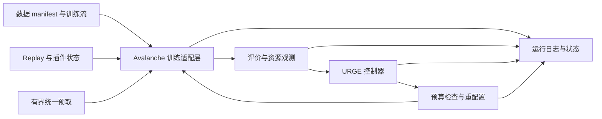

# 方法与测量规范

本文件保留数据、模型、公式、训练时序与测量定义；沿用原章节编号以便源码引用。实验范围、优先级与完成标准仅以根目录 PLAN.md 为准。这里提及旧 E 编号或基线是技术背景，不要求恢复旧全矩阵。

## 4. 环境、数据与配置冻结

### 4.1 环境建立及版本决策

1. 用已有 Conda 管理工具新建 `orion`，起始候选 Python 3.11；这只是兼容性起点，不是作者版本。如源码依赖要求不同，记录后调整。
2. 从官方发布源选择支持 sm_120 的 PyTorch CUDA wheel 与匹配 torchvision。复用 Windows NVIDIA 驱动，依赖的 Linux CUDA 运行库由 `orion` 独立安装。
3. 安装并锁定 Avalanche，以及实际所需的求解器、指标、数据和绘图库。不盲目升级全部包，也不复制 `mineru`。
4. 先做 T01，再做 Avalanche ER/GEM/AGEM/GSS 的微型训练；如兼容性失败，优先小补丁或切换有证据的相邻版本，记录失败组合。不要仅以 import 成功认定可用。
5. 保存 `environment.yml`、精确依赖清单、Avalanche commit、安装命令和环境检查结果。安装期间不修改 Windows 驱动或 WSL 全局设置。

起始研究实现默认 FP32、eager、不启用 AMP/torch.compile/额外量化；明确 TF32、cuDNN benchmark 与 deterministic 设置。任何性能变体对所有比较方法公平开放，并独立标记。GPU 预热使用合成数据，训练状态和 RNG 恢复后再进入正式数据。

### 4.2 数据契约

| 数据集 | 论文规定 | 必须核查 |
|---|---|---|
| SplitCIFAR10 | 10 experiences，60000 总图像，32×32 | 采用官方 train/test；10 个类对应 10 experiences，不能沿用框架常见 5 分割 |
| SplitCIFAR100 | 10 experiences，60000 总图像，32×32 | 每 experience 的类集合与顺序，不能误解为每类一个 experience |
| CORe50-NI | 8 experiences，164866 总图像，32×32 输入 | 官方 session/split/run index、分类粒度和测试集处理 |
| CORe50-NC | 9 experiences，同数据源 | 首批/后续类数不必均等；采用官方映射，禁止自行均分替代 |
| CORe50-NIC | 79 experiences，同数据源 | 核对是否 NICv2-79、官方文件列表及 run index，不能只按数量猜版本 |
| Endless-Sim IC/IL/WC | 4/5/5 experiences，49134/181899/188536 总图像 | 公开 classification 子集与标签/顺序；IL 指 illumination，WC 指 weather |

每份 manifest 包含下载来源、校验和、许可信息、原始版本、样本 ID、label、train/test/control/dev 标记、experience_id、源文件和预处理版本。保存每个 experience 的训练/评价样本数及类分布，检查 train/test 不重叠；同一原样本 ID 不能因为生成多个文件而被误视为独立样本。

常规图像在 CPU 保留 uint8 或磁盘文件，进入 minibatch 时再变换。CORe50 原始尺寸大于论文输入，使用按需读取或可重建的 32×32 派生缓存，不把全集原图常驻 RAM。缓存改变 I/O 的实验意义，所有方法同用同一缓存政策，并记录 cache warm/cold 条件。

默认单分类头、测试不提供 task oracle、不自动屏蔽未见类；如果原方法需要不同设置，按 A02/A07 单独记录。CORe50 默认候选为 50 对象类，最终以所选官方协议与论文证据为准，不能把 10 大类结果与 50 类结果混用。

### 4.3 开发集、校准与正式测试的隔离

为弥补缺失参数，需要开发阶段，但必须披露其成本与信息使用范围：

- 从官方训练数据生成固定开发 manifest。CIFAR 可按类分层；视频/连续帧数据应按序列或连续块分组，避免近邻帧随机分到开发训练和验证两边。比例根据最小 experience 保证可用，写入 manifest 后冻结。
- 起始建议开发 seed 为 17，正式主比较 seeds 为 `[0,1,2]`；这些是本项目协议，不是论文提供值。拆分 seed、模型 seed、流顺序 seed、replay seed、augmentation seed 分开记录。
- 开发数据可以覆盖多个 experiences 以重建缺失设置，但必须称为离线开发/校准，不能宣称完全没有离线信息。其预算和成本分开报告，并给基线相同的调参机会。
- 正式 `paper_feedback` 在参数冻结后用完整官方训练集和官方测试协议。正式 `validation_feedback` 从训练数据保留控制集，各方法使用相同训练子集；两协议的数据量不同，不能直接当公平配对结果。
- 测试可按论文解释在每个已见 experience 后用于反馈，这属于 `paper_feedback` 的明确限制；测试值不能再用于人为搜索缺失超参数、选择随机种子或筛选论文图表。
- 没有依赖测试的 early stopping。单遍流不得因为准确率不足额外加 epoch。若配置更改，生成新版本，保留已有所有结果。

### 4.4 参数分级与冻结规则

| 参数组 | 起点 | 决策方式 |
|---|---|---|
| 网络/输入/经验数 | 论文明确的 ResNet-20、32×32、表 2 | 逐项核对，无理由不改 |
| SGD 等学习配置 | 原方法或选定框架范例 | 缺失时最多先比较 3 个有来源的学习率候选；固定优化器、momentum、weight decay、scheduler |
| ER 初始 batch/replay | 优先读取选定版本的实际默认值；必要时以 batch 16、replay 200 作为调试起点 | 标为 starter；正式采用值经过开发集检查并冻结 |
| 插件参数 | GEM/AGEM/GSS/EWC 原方法及框架要求 | 保存所有必填参数，不用无记录的默认值 |
| URGE 参数 | §6 的原式；数值缺失 | 先数值诊断，再有限开发集选择，敏感性见 E08 |
| host/device 预算 | 初始空载状态与 E01 剖析 | 冻结统一预算值，低/中/高至少 3 档；不能逐方法挑上限 |
| 预取/worker | queue depth 起点 1–2，worker 起点 0–2 | 在开发集测吞吐与内存，保持有限队列 |

正式配置不得留 `null`、`auto`、`TBD` 等未解析控制量；允许 `null` 仅代表显式不适用/观测不可用，并说明原因。自动估计值必须在 run 开始前解析并保存。配置冻结是 agent 的技术检查点，不是每次都请求用户批准的流程。

## 5. 指标与评价数据设计

### 5.1 准确率矩阵

令 `A[k,i]` 表示完成第 k 个训练 experience 后，在评价集合 `T_i` 上的准确率；逻辑下标从 1 开始，日志用 `experience_index` 明确映射。只把已见 experiences 的指标提供给控制器。保存 correct/total，避免事后无法重算按样本加权指标。

论文 §2.1 的 `acc_i` 时间索引不充分明确。起始主解释定义：

\[
P_k^{diag}=\frac{1}{k}\sum_{i=1}^k A[i,i],\qquad
F^{initial}_{k,i}=A[i,i]-A[k,i],\qquad
S_k^{initial}=1-\frac{1}{k-1}\sum_{i<k}F^{initial}_{k,i},\quad S_1=1.
\]

这对应学习各 experience 当时的适应能力和随后相对初始表现的遗忘，是 **A05 的操作性定义，不是已经确认的作者指标实现**。同时输出：

- `avg_seen_accuracy_k = mean_i<=k A[k,i]`，另存按样本数加权的版本。
- `forgetting_max_k = mean_i<k(max_{j=i..k} A[j,i] - A[k,i])` 与 `stability_max_k = 1-forgetting_max_k`。
- 当前 experience accuracy、最终全测试准确率、各 experience 曲线、P/S 最终值与经验平均值。

`F_initial` 可以为负，`S_initial` 可以大于 1，不得静默裁剪；若控制器需要 bounded 指标，使用单独的 protocol ID 并记录变换。不得只报告稳定性，因为没有学到新知识的模型也可能表现为遗忘很少。

主要报告 `P_N`、`S_N`；经验平均值分列。论文图表到底使用哪一种汇总若仍不明确，两个口径均提供，不能挑更接近论文的一种当作唯一答案。

### 5.2 评价与训练的状态隔离

评价使用 no-grad 和 eval mode，不更新 BN、优化器或 replay，不改变训练用 RNG；退出时恢复训练状态。验证 `EvaluationPlugin` 或自定义 evaluator 的指标与矩阵离线重算一致。用只读 `MetricSnapshot` 传给控制器，防止控制器访问整个测试集或未来流。

### 5.3 CORe50 共享测试集的处理

先核对所选官方协议是否提供独立 `T_i`。对 NC 如使用类集合对应的测试切片，记录每片标签和 test mask；不得在预测端启用未声明的 task oracle。

对 NI/NIC 如只有固定共享测试集 `T_shared`，不能编造官方逐经验测试集。采用明确命名的 `shared_test_temporal` 解释：每个 k 记录 `a_k=acc(model_k,T_shared)`，令 `A[k,i]=a_k` 仅作为上述时间公式的记账视图。此时 `P_diag` 是历史共享测试准确率均值，`S_initial` 是相对各历史时点的平均变化，**不是不同经验知识的独立遗忘测量**。主表必须同时给出 `a_k` 曲线，并与独立 `T_i` 的结果分组。

如作者资料能确认更合适的原口径，替换该解释并重算/重跑依赖它的控制器实验。对两种合理 P/S 定义至少做代表性敏感性比较。不能仅凭 shared-test temporal 得分证明与论文相同的稳定性结论。

## 6. URGE 控制器规范

### 6.1 原式与数值实现

令 `sigmoid(x)=1/(1+exp(-x))`，按论文式 (1) 实现：

\[
U_t=\sigma[-k_p(P_t-P_{th})]\,
\sigma[-k_s(S_t-S_{th})]\,
\sigma[k_l(L_t-L_{th})]\,
\sigma[-k_m(M_t-M_{max})].
\]

采用数值稳定的 float64 sigmoid，输出四个 factor 和乘积。禁止直接将乘积改为和、min/max 或重设计控制律。极端输入、溢出、underflow、NaN 有专门检查；稳定实现不改变数学语义。

内存原始日志统一 bytes，原式计算默认转换为明确声明的 MiB；延迟用秒，P/S 用比例值。MiB 是 A04 的操作选择，作者单位未确证。保持单位一致的 bytes/MiB 互换需要相应转换系数；若系数不换，属于不同模型，必须单独命名。归一化为资源占用率/相对延迟的版本仅作 `normalized_variant`。

按 §4.4 的 rank 权重：四指标按偏好排序赋值 4/3/2/1，再除以 10。balanced 依据 §5.2.3 的等权描述取各 0.25。偏好排序候选写入配置；例如 latency-first 的 `[memory,latency,plasticity,stability]`、P/S-first 的 `[memory,plasticity,stability,latency]` 是复现选择，不是作者完整预设。

不要假定增大某个 k 必然“更重视”某目标：sigmoid 在阈值两侧的影响不同，需记录 E05 实测行为。也不要照搬示例 `U=0.8, Thr=0.7` 作为可达工作点；四个 factor 均为 0.5 时 U 只有 0.0625。应先扫描实际指标范围，检查阈值是否让控制器始终收缩或始终不变。

### 6.2 时间与状态更新

运行时用 `k=0..N-1` 表示已执行的 experience 索引，避免原文 `MB_{t-1}` 在 t=0 时无定义：

1. 用 `state[k]` 训练第 k 个 experience，仅一次新流 SGD 遍历。
2. 完成该算法规定的边界处理和评价，得到 metrics[k]。
3. 计算 `U_k` 与 `Thr_k=Thr0*exp(-delta*k)`。
4. 若仍有下一 experience，计算 `MB_next=MB_current*(1+alpha*(U_k-Thr_k))`，`MR_next=MR_current*(1+beta*(U_k-Thr_k))`。
5. 将 `floor(MB_next/m_batch)`、`floor(MR_next/m_frame)` 映射为下一配置，再执行显式预算检查和重配置。
6. 最后一 experience 的建议可记录，但不分配无用的新状态。

MB/MR 保留浮点预算，不能在每次 round 后丢失小额累积。参数必须使乘法因子合法；检测负值或非有限数时配置报错，不能悄悄改系数。

Algorithm 1 使用 `>` 判断，而式 (5) 在等号处用 `>=`。默认按 Algorithm 1，等号时预算不变、可选插件取 default；等号选择记入 A03 并测试。初始配置直接使用明确的 MB0/MR0/MO0，不用尚不存在的评价值生成它。

### 6.3 控制参数的开发与敏感性

参数不是从最终测试结果倒推。对 P/S 阈值优先使用来源支持的值；缺失时依据开发集固定静态参考运行确定。L_th 和内存成本由开发剖析确定，跨 experience 是否同一阈值必须在配置中明确。

起始数值诊断使用 `alpha=0.1, beta=0.2` 作为论文举例支持的候选，而非正式默认。`Thr0` 可从开发静态轨迹 U 的低/中/高分位数构造有限候选；`delta` 用“整个流阈值保持 1 / 衰减到 0.5 / 衰减到 0.1”转换为每 experience 衰减率。说明使用了流长度 N 的先验，不能称为无限流自适应。

先固定学习配置，再选择少量控制器候选，避免同时搜索所有参数使归因失效。每个候选、目标函数、开发数据和耗时均记录。E08 还必须包含不从轨迹选阈值的固定先验候选，以检查结论是否依赖离线校准。

### 6.4 batch/replay 的含义

`new_batch` 为每个 SGD 步的新流样本数；`replay_batch` 为同时回放的样本数；`effective_batch` 为实际合并数。第一 experience 无历史 buffer 时 replay 为零。起始 ER replay ratio 为 1 或所选官方实现值，作为 A08 记录；不得将 replay ratio 当成 replay 容量。

`m_batch` 应按固定 replay ratio 的合并训练成本剖析，包含激活与反向峰值；不是仅用 `3*32*32*4` 计算。固定模型/优化器内存作为截距，不能随 batch 重复计费。GEM/AGEM 的参考梯度计算等额外成本另列。

`m_frame` 对实际存储表示计费，标签、索引和容器开销另记。profile 表包括预测和实测误差，区分 CPU/GPU。公式映射产生的 `suggested_config` 与预算保护后的 `applied_config` 都写入日志。

对 MO 按 §4.3 的近似思路保留 `MO_default`、`MO_advanced` 与 `k_opt=MO_advanced/MO_default` 的估计：在同一资源范围内，将无法归到 MB/MR 的剩余占用视为 residual，再通过开发阶段的 default/advanced 配对剖析估计倍率。论文中残余量并不只包含插件，必须同时保存测得的插件状态字节与 residual，不能把系统噪声或模型固定成本称为插件内存。倍率不可用/分母接近零时显式标记并用独立测得的两种成本，记录为 A13 适配。测量差产生负 residual 说明记账范围或噪声问题，不能静默裁零后当准确模型。

## 7. 学习系统、replay 与预取设计

### 7.1 总体架构与职责



| 模块 | 输入与输出契约 | 约束 |
|---|---|---|
| `BenchmarkFactory` | manifest/config → 有序 train/control/test streams | 不隐式更换 split，不预读未来标签供控制 |
| `StrategyAdapter` | model/optimizer/base algorithm → Avalanche strategy | 只承担 API 与生命周期适配；不混入调参 |
| `MetricEvaluator` | model、已见评价域 → accuracy records、MetricSnapshot | 不改训练状态 |
| `ResourceProbe` | 当前进程/设备 → ResourceSnapshot | 不可用项写 null+reason，不伪装为 0 |
| `MemoryCostModel` | profile、当前算法状态 → CPU/GPU 成本估计 | 明确包含项和误差，不能视为 OOM 保证 |
| `UrgeController` | current state、metrics、profile → proposal | 纯决策函数，易于公式测试；不直接分配内存 |
| `BudgetGuard` | proposal、实际余量、限制 → applied config 或中止 | 显式记录裁剪；不冒充论文控制器 |
| `ReplayAdapter` | 新样本/容量指令 → 有界历史样本集 | 扩容不恢复已丢弃历史，缩容要真正释放引用 |
| `PluginManager` | algorithm、requested mode → 插件状态变换 | 保留必要基础算法，避免重复 GEM 等插件 |
| `UnifiedPrefetcher` | 已计划新流+回放批次 → 有界队列 | 不能提前读取未来梯度/标签作决策 |
| `ExperimentRunner` | frozen spec → run artifacts | fresh process、状态机、失败与恢复 |

Avalanche 官方 ReplayPlugin 的 batch、memory batch、存储更新与生命周期不应只靠改一个属性推断生效，实施前核对锁定版本源码：[ReplayPlugin](https://raw.githubusercontent.com/ContinualAI/avalanche/master/avalanche/training/plugins/replay.py)、[storage policy](https://raw.githubusercontent.com/ContinualAI/avalanche/master/avalanche/training/storage_policy.py)。本计划不把当前 master 当作已锁定版本。

### 7.2 基础算法与可选插件

基础算法 ER/GSS/GEM/AGEM 必须始终保留自身语义。`default` 表示没有额外可选优化，不能把基础 GEM 在资源紧张时直接关闭并继续称为 GEM。

- ER 起步：default 为 ER，advanced 候选为 ER + GEM + EWC，依据 §3 表 1。分别测 GEM-only、EWC-only 以定位贡献与成本。
- GSS/AGEM：在基础算法上尝试有记录的可选 GEM/EWC 组合，固定梯度约束与正则执行顺序；如组合数学语义冲突，先完成单独算法，再通过 A10 的具名解释处理，不默默省略。
- GEM：advanced 至少避免再次叠加相同 GEM；若采用额外 EWC，明确这是消除重复后的重建方式。
- 每种组合保存 base algorithm、插件集合、参数、执行顺序、独立/共享样本状态。一个相同 buffer 的物理共享不能把不同算法要求的采样分布也强行合并。

可选插件关闭时，默认释放其可重建的状态；再开启只用当前合法保留的历史和后续数据初始化，不能从完整磁盘历史偷偷恢复被丢弃样本。若选择暂停计算但保留状态，该状态继续计入内存，不能报告关闭后已释放。两者作为显式模式比较，不能临时混用。

某些官方插件会假设每个历史 experience 都有状态；必须适配缺失历史键并测试 off→on→off→on。修改优化器或插件列表不能重新初始化网络、清空不该清空的优化器状态。

### 7.3 single-pass 的准确含义

新流每个样本仅参与一轮主 SGD 学习，不通过重复 launch 或多 epoch 增加主训练次数。replay 是算法允许的历史重复。

边界插件可能需要额外遍历当前 experience，例如 Fisher 估计；这与多一轮参数更新不同，也不等于严格只读取一次数据。官方 [EWC 实现](https://raw.githubusercontent.com/ContinualAI/avalanche/master/avalanche/training/plugins/ewc.py) 和 [GEM 实现](https://raw.githubusercontent.com/ContinualAI/avalanche/master/avalanche/training/plugins/gem.py) 可作为核对入口。

主协议允许来源要求的当前 experience 辅助统计遍历，但记录 `new_sgd_visits`、`replay_visits`、`auxiliary_visits` 和计算/数据成本，明确是 experience 级在线。不能在未来任意时点重新遍历完整旧 experience。若改为 minibatch 内在线估计 Fisher/逐样本单次读取，属于方法变体，应另命名。

### 7.4 replay 扩缩容与真实内存

按来源实现经验平衡、类别平衡或 reservoir，不能混称。逐 experience 更新与逐 minibatch 更新是不同协议，默认跟随所选来源并记录。所有保留项有稳定 sample_id；扩容只能纳入未来合法到达的样本及仍在允许边界内的当前经验样本，不能填回被淘汰历史。

正式内存实验的默认表示为被选样本的紧凑 uint8 物化副本或算法要求的 tensor/latent，记录 dtype/shape。对照来源的 index-only 模式可用于语义验证，但若它保留底层整个数据集，必须计入 retained backing storage。不能为了模仿论文内存数字故意填充无用途字节。

resize 后检查旧 dataloader、worker、预取队列和闭包不再持有淘汰样本。实际装填量、逻辑容量、物理分配量分别记录。容量大于已见样本数时按实际语义处理，不能复制样本来“填满百万 buffer”。

### 7.5 有界统一预取

首先用一个 CPU producer 和有界队列实现，GPU 主线程训练。由主线程先确定 sample_id、回放选择和 augmentation seed，producer 仅执行读取、解码、变换和拼批。每个 item 带 `experience_id, config_version, step_id`，控制器重配置后不能消费旧版本批次。

队列至少统计等待、占用、最大深度、bytes、丢弃原因和 producer 异常。退出或取消时可靠 join，不留下后台线程或 GPU tensor。预取下一 experience 时只允许读取已给定流的输入，不能提前更新 buffer、模型或访问其评价结果。

replay 每步会更新的算法不能用未来尚未确定的状态预采样。对 GSS/AGEM 等先保证与串行实现选择一致，能重叠哪些阶段就记录哪些阶段。必要时只预取新样本与已确定的 replay 读取，不牺牲语义换速度。

pin_memory 和异步 H2D 是独立开关。只有验证有界 pinned memory 可用、生命周期正确且计时一致后开启；主消融不能同时改变预取、worker 和 pinning 三个因素。

### 7.6 一个 experience 的规范事件顺序

```text
apply state[k] → 建立当前 loader / 有界预取
→ 训练新流一遍（含算法规定 replay、投影和正则）
→ 当前 experience 的 buffer 更新 / 辅助统计（按固定来源顺序）
→ GPU 同步并结束 learning 计时
→ 评价已见评价域，生成 metric snapshot
→ 计算 U/Thr 和 next proposal
→ 验证预算，停止或清空旧队列，重配置下一状态
→ 写入记录与可选边界 checkpoint
```

不调用两次同一 experience 的 train。训练后 buffer 更新发生在当前预算下，若因原始静态配置超限应保留失败；控制器无法挽救发生在控制前的 OOM。若增加边界预防机制，需计入 BudgetGuard 并在所有对照中说明。

## 8. 内存预算、计时与失败语义

### 8.1 资源观测模型

`ResourceSnapshot` 至少包括：时间戳、进程与子进程 RSS、可获取的 PSS/USS、系统 available、swap 使用、GPU allocator allocated/reserved/current/peak、可获取的 GPU 全局 used/free、来源和采样间隔。

不能把各进程 RSS 简单求和当精确物理占用，因为共享页可能重复；PSS 不可用时说明误差。GPU 全局占用可能包含 Windows 应用，不能与 PyTorch 分配量相加。cgroup 内存若可用，另报 page cache 等记账范围。

起始采样间隔候选 100ms，在开发检查中量化监测开销；阶段边界另取快照，CUDA allocator 峰值在每个统计阶段 reset。采样峰值是观测下界，不保证捕捉所有瞬时尖峰。主方法、基线和消融使用同一采样设置。

### 8.2 三类预算能力

| 类型 | 约束与用途 | 可作出的结论 |
|---|---|---|
| `observed_only` | 只测实际内存，没有施加上限 | 资源占用对比；不能声称通过硬预算实验 |
| `host_enforced` | 可用的进程组/cgroup 上限及 swap 策略，包含全部实验子进程 | 该记账范围下是否完成；退出原因需由限制机制日志确认 |
| `device_allocator_enforced` | PyTorch 所选版本的分配器配额或等价可核实机制 | 分配器范围内是否超限；不能称驱动/GPU 全占用硬上限 |

先检查 WSL 对实验专属资源组的支持与权限，用受控小进程测试限制确实生效，不修改系统全局内存或杀死其他进程。CPU 限制不可用时继续 `observed_only` 或可用的 device 实验，将 host 强制预算标为 blocked，不能以采样 watchdog 冒充同步硬限制。超时/信号退出本身不证明 OOM。

按 `host` 和 `device` 两条资源受限线分别运行，另一资源保持足够且记录。对应主 URGE 的 M 使用相同资源范围的经验内峰值，`M_max` 对应该范围预算。host→device 切换是平台适配，不混算一个分数。

需要联合资源时可以另设 `dual_resource_variant`，如使用两个内存因子或最大利用率，但它改变原式输入含义，不能归入原四因子实现主结论。

### 8.3 原式控制与附加保护分离

所有方法共用“记录 + admission check + 违规终止”的机制，静态基线超限时不自动缩 batch。正式主方法 `orion_formula` 按 §6 输出，离散 batch 最小合法值等必要映射有记录；若不能满足预算就终止并记录，不自动重试。

可额外实现 `orion_guarded`，对建议预算进行裁剪、回退或 OOM 恢复。它是工程扩展，单独报告干预次数、丢失状态、重试耗时、样本是否重复处理。必须至少在代表性条件比较 `orion_formula` 与 `orion_guarded`，避免把保护层成功归因于 URGE。

如果希望给静态方法同样的自动裁剪，另建 `static_guarded`。任何改变 batch/replay 的基线不再是原静态配置，名字与曲线不能沿用未限定 MAX-A/MAX-P。

### 8.4 预算选取

在 E01 开发剖析中，先获得空载固定成本和合理静态配置的峰值范围，再冻结低/中/高三档绝对预算；必须高于框架最小启动成本，且低于当前可安全使用的本机资源。初始开发可用参考峰值的约 0.8/1.0/1.2 倍构造候选，截断到合法范围并记录；比例不是论文值。

低预算允许有方法失败，但不能人为逐个调预算恰好卡死基线。对一个数据集/算法比较组使用相同预算和计费范围。基础对比的参考预算 B0 与额外压力扫描预算分开；未运行的预算格写 planned/blocked，不填零。

### 8.5 计时口径

- `setup_s`：进程启动、模型构建、数据加载等；下载和一次性派生数据准备单列。
- `learning_s`：新流训练、replay、梯度投影/正则、算法必需的 buffer 更新与 Fisher 等辅助计算；含实际数据等待和 H2D。作为主要训练耗时比较口径。
- `evaluation_s`：指标评价和为控制器生成反馈的成本。
- `controller_s`：数值计算与决策；`reconfigure_s`：实际状态/loader/插件重配置。
- `checkpoint_s`、`logging_s`：单列；`online_total_s` 使用实际覆盖整个流循环的 wall clock，不把重叠阶段简单相加。
- `prefetch_wait_s`：消费者等待；producer CPU work 与 GPU work 可能重叠，只作诊断，不重复加到总时长。

在完整阶段边界同步 GPU。不要为主延迟结果每个操作都 synchronize；详细 profiler 作为独立诊断运行，不能与轻量监测结果混报。预热、首次加载、缓存政策和 checkpoint 频率在各方法一致。

### 8.6 失败与恢复

run 状态枚举：`planned / running / completed / preflight_infeasible / cuda_oom / host_oom / budget_exceeded / timeout / numerical_error / implementation_error / interrupted / blocked`。失败记录包含阶段、experience、step、最近配置、资源轨迹、异常栈、限制机制证据和是否发生参数更新。

每个配置使用 fresh process，OOM 后退出，不能在被污染的训练状态中继续当作同一次干净结果。下一配置从已冻结的相同初始条件开始。

中断恢复优先在 experience 边界：保存模型、优化器、scheduler、RNG、buffer 内容/采样权重、插件状态、控制器状态、数据游标和累计原始指标。恢复结果单列 `resumed=true`；模型/指标可验证连续性，但主延迟比较优先使用完整不中断运行，不拼接成未经说明的 wall time。

超时上限根据开发试跑和状态增长预先设定，允许慢算法有合理运行窗口；不能设置恰好排除慢基线的统一短超时。对外部负载、时间中止和实现错误分别计数，不归为内存失败。

### 8.7 开销分解的具体方法

E09 同时提供两类结果，避免把净加速误称为没有开销：

- 组件成本：直接测 controller、reconfigure、预取 producer/队列操作的 CPU 时间或 wall time，并说明可重叠项。与同一 run 的 `learning_s`、`online_total_s` 分别求比，不混用分母。
- 系统净影响：在相同学习 schedule 下与对应关闭模块的运行配对，报告端到端差值。该值可能为负，表示净收益；它不代替组件实际工作量。

内存分别给出模块持有对象/tensor 的去重字节数、固定 schedule 开关模块的进程/allocator 峰值差，并声明共享/缓存/分配器影响。百分比同时注明除以物理容量、施加预算还是基线峰值；论文表 7 若分母无法确认，则不直接比较百分数。

微基准可重复调用纯控制器以测量微小成本，但不得据此推断整次训练开销，或把异步队列的 CPU 时间与 GPU 时间直接相加。本机能耗测量如做，需记录功率来源、采样频率、积分时间段、是否仅 GPU 和背景功耗；没有测量分辨率支持时不对极小能耗差给出结论。

## 9. 基线实现规格与 Oracle

### 9.1 基线卡

每个方法建立 `docs/baselines/<method>.md`，包含来源、算法本体、插件、batch/replay/优化器、latent 层、存储、加载器、预算处理和与作者未知处的差异。

| 方法 ID | 实现要求 | 禁止的替代 |
|---|---|---|
| `er_static` | 作为开发和消融参考的固定 ER | 不能自动当作 MAX-A |
| `max_a_reconstructed` | 所选来源的固定 batch/replay，并按论文实现高级优化插件；记录确切值 | 仅设置小 batch 或人为加无用耗时 |
| `max_p_reconstructed` | 固定大 batch、小 replay，以开发吞吐与来源确定可执行值；正式运行不自适应 | 暗中给它降学习率/删训练样本，或仅对它关闭共同加载优化 |
| `lr_reconstructed` | 真正缓存并回放中间特征，按来源处理下层学习和特征陈旧问题 | 把 raw ER 改名 LR、随机冻结骨干、使用另一个模型后仍称同骨干对比 |
| `orion_formula` | 本计划明确解释下的原公式、动态配置、可选插件与统一预取 | 用不同控制律替代并保留原名 |
| `oracle_reconstructed` | 完整 42 网格、事先固定选择规则及单次最终执行 | 只跑几组或逐指标挑不同运行拼成一个“最佳模型” |

Latent Replay 原论文与官方实现提供参考，但不等于 Orion 作者的 ResNet-20 适配：[原论文](https://arxiv.org/abs/1912.01100)、[作者代码](https://github.com/lrzpellegrini/Latent-Replay)、[PyTorch 实现](https://github.com/vlomonaco/ar1-pytorch)。实施时明确 latent 层、前段参数/BN 更新、后段梯度、特征 dtype 与保存时点，再与统一骨干要求协调。

E04/E10 中 `LR × GSS/GEM/AGEM` 必须逐组合定义并验证：样本选择用 raw 还是 latent、参考梯度覆盖哪些参数、特征更新后旧缓存如何使用。不能把同一 AR1+LR 结果复制到四个算法行，也不能把 raw replay 与 latent replay 的存储成本混合。无法依据材料唯一确定组合时，记录具名的适配解释及影响；缺少可正确执行的实现应标为未完成，而非伪造该 cell。

MAX-P 的“高效实现”不能简单认为等于开大 batch；核对可共享的工程优化，至少提供统一加载后端下的对照。历史默认配置的作者效果无法确认时使用 `_reconstructed` 名称直到有证据。

